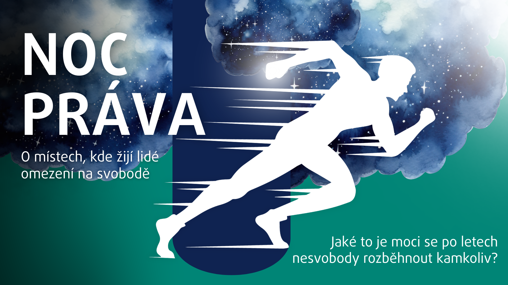

Hrdinové filmu Jana, René a Krištof osobně promluví o svých zkušenostech a cestě, která je zavedla až ke změně života po odchodu z vězení. Na otázky okolností vzniku filmu odpoví jeho režisérka Zuzana Dubová. A zkušenost života nejen za mřížemi přiblíží i právníci Kanceláře ombudsmana a dětského ombudsmana, kteří fyzicky objíždí místa, kde jsou lidé omezení na svobodě. Tam nepatří pouze věznice, ale i dětské domovy, domovy pro seniory, nebo třeba psychiatrické nemocnice. 

> Nezmeškej příležitost diskutovat s námi o svobodě a životě za zavřenými dveřmi. Projekce se uskuteční ve velkém sále v Kanceláři ombudsmana a dětského ombudsmana ve středu 18. března od 17 hodin. 
>
> Na programu nebudou chybět ani tradiční prohlídky sídla ombudsmana a dětského ombudsmana. Začínají v 15:30, 18:30 a 20:00 v atriu před sochou Spravedlnosti.
