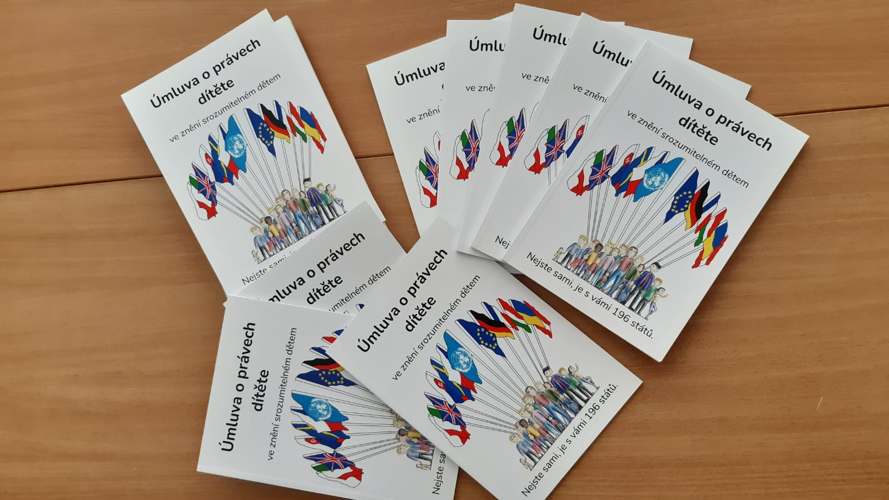
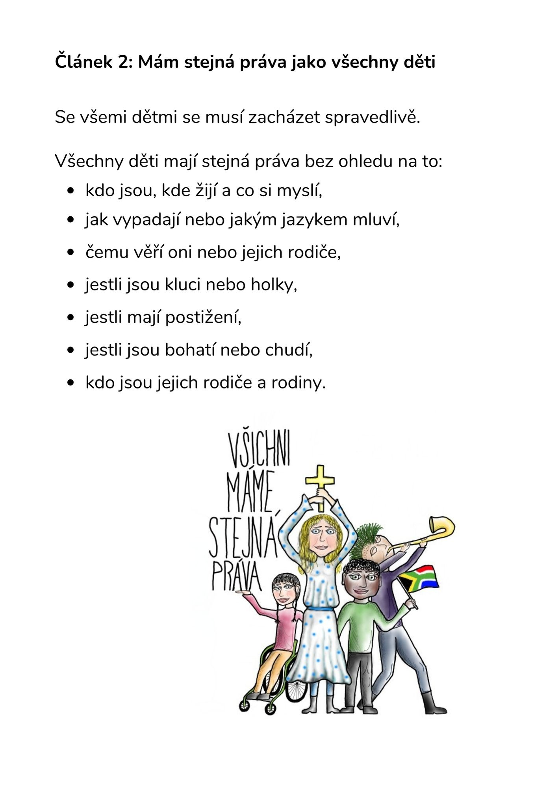
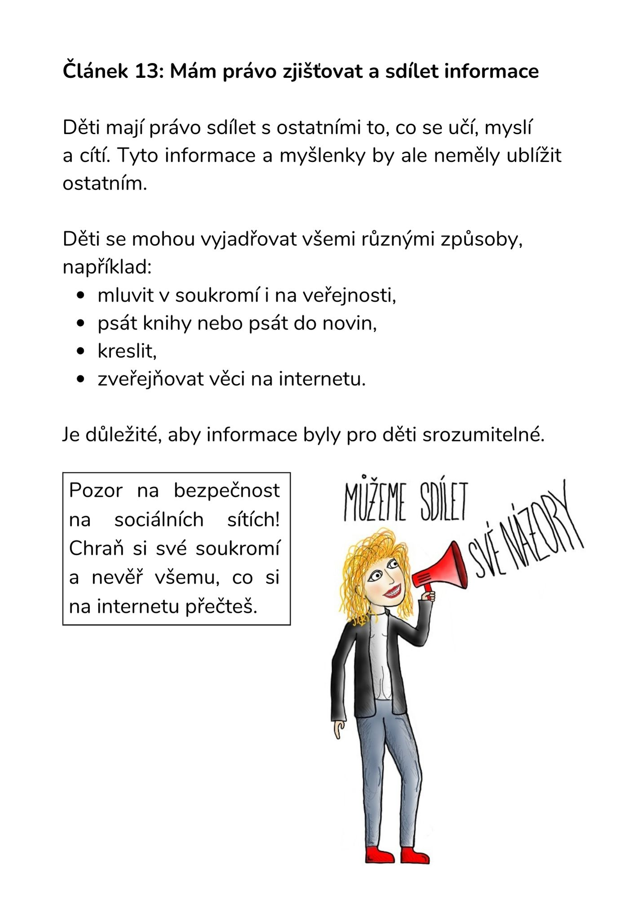

Úmluva o právech dítěte je mezinárodní smlouva. Je závazná pro státy, které se v průběhu let rozhodly ji dodržovat. Běžnému (dětskému) čtenáři se však čte špatně. **A to jsme se rozhodli změnit.** 

**Úmluvu o právech dítěte jsme přepsali tak, aby jí rozuměl každý. Výrazně jsme její znění zjednodušili a doplnili o ilustrace sedmnáctiletého Vojty.** 

Posuďte sami, zda se nám to povedlo. Naši [Úmluvu ve znění srozumitelném dětem](/media/umluva_o_pravech_ditete_web_pdf.pdf) můžeš volně šířit mezi kamarády a kamarádky. Pokud bys jí chtěl/a mít ve své domácí knihovně, můžeš si o ni [napsat](https://deti.ochrance.cz/kdo/jak/). My Ti ji rádi pošleme.

> Úmluva o právech dítěte je mezinárodní smlouva přijatá Valným shromážděním OSN v listopadu 1989. Česká republika ji podepsala v září 1990. K jejímu dodržování se zavázalo již 196 států světa. Dodržování Úmluvy o právech dítěte kontroluje [Výbor pro práva dítěte OSN](https://www.ohchr.org/en/treaty-bodies/crc). Plné české znění Úmluvy o právech dítěte najdeš třeba [zde](https://www.zakonyprolidi.cz/cs/1991-104).

*Publikace vznikla v rámci projektu Posílení aktivit veřejného ochránce práv v ochraně lidských práv (směrem k ustanovení Národní lidskoprávní instituce v ČR), číslo projektu: LP-PDP3-001. Tento projekt je financován z prostředků fondů EHP a Norska 2014-2021 a státního rozpočtu ČR.*