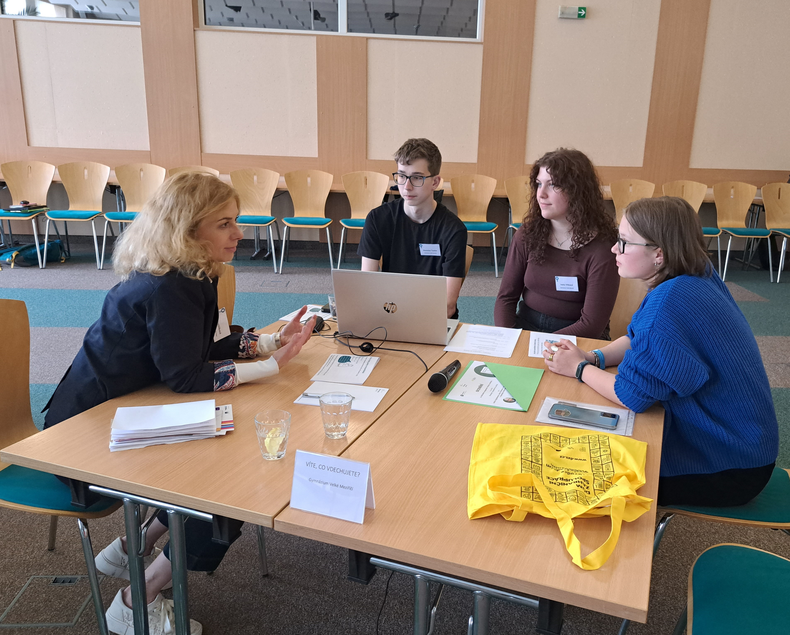
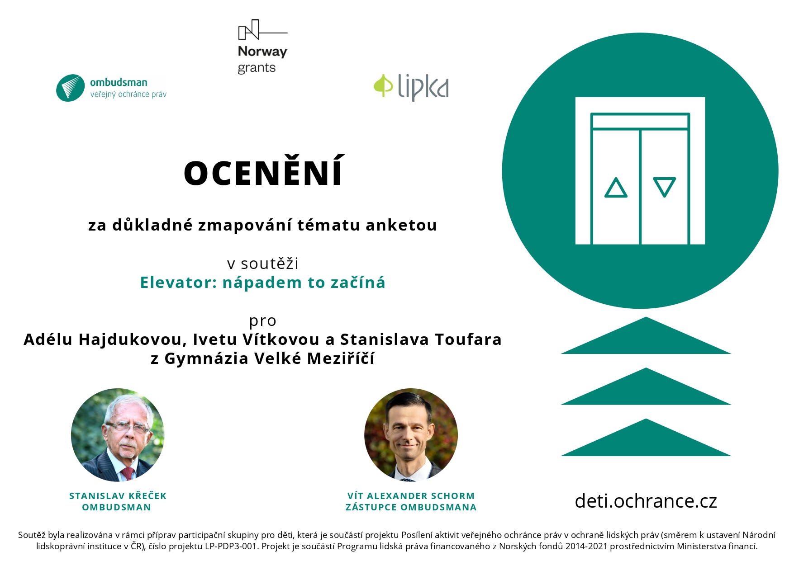

Adéla, Iveta a Standa vytvořili plakát, na kterém informují své vrstevníky o nebezpečných látkách, které e-cigarety obsahují. Naplánovali jeho umístění ve Velkém Meziříčí tak, aby si ho všimlo co nejvíce dětí ve věku 12-15 let. V příštím školním roce chtějí k tématu uspořádat krátké interaktivní  přednášky pro studenty různých škol.

Ombudsman pozval celý tým k pracovnímu setkání. Studenti svůj projekt nejen představili, ale setkali se také s několika poradci z řad nejrůznějších odborníků. Mimo jiné s Ivou Hrnčiříkovou, která vede[ Informační a edukační centrum při Masarykově onkologickém ústavu](https://www.mou.cz/informacni-a-edukacni-centrum/t1479). Za jejich pomoci upravili svůj plakát a zamýšleli se nad nejúčinnějšími strategiemi, jak oslovit vybranou cílovou skupinu.

Po setkání tak navázali spolupráci s řediteli škol ve Velkém Meziříčí a praktickými a dětskými lékaři v okolí. Své plakáty umístili nejen do škol, ale také do vybraných čekáren a ordinací. Dále pracují na výběru míst, kde by mohli šířit svou osvětovou kampaň zaměřenou hlavně na nebezpečné účinky jednotlivých látek na lidské zdraví.

A jak naši soutěž zhodnotili sami velkomeziříčtí studenti? Přečtěte si v jejich [článku](https://www.gvm.cz/images/stories/Aktuality/Elev%C3%A1tor.pdf), ze kterého vybíráme úryvek: 

***"Vůbec jsme netušili, že by někdo mohl vidět v našem projektu a v nás samotných takový potenciál. Všichni, se kterými jsme mluvili, byli moc milí a ochotní. Dostali jsme několik vizitek, letáčků a také nabídek pomoci. Z budovy jsme odešli po patnácté hodině. Hrdí, vyčerpaní, ale hlavně šťastní, že se nám podařilo uspět."***

> Setkání vybraných týmů (participační skupiny) jsme uspořádali v rámci projektu Posílení aktivit veřejného ochránce práv v ochraně lidských práv (směrem k ustavení Národní lidskoprávní instituce v ČR), číslo projektu LP-PDP3-001. Projekt je součástí Programu lidská práva financovaného z Norských fondů 2014-2021 prostřednictvím Ministerstva financí.