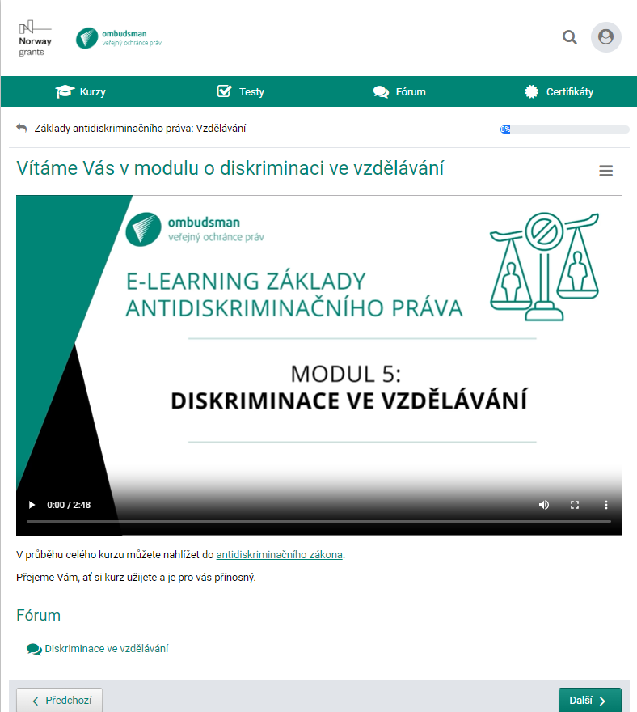

V e-learningu vycházíme ze skutečných případů, které jsme řešili. Využíváme také poznatky z našich výzkumů a doporučení. 

Kurz má celkem šest částí (modulů). Zaměřili jsme se na jednotlivé oblasti života, ve kterých se s diskriminací můžete nejčastěji setkat. Jde o diskriminaci ve vzdělávání, pracovním prostředí, v bydlení a v přístupu ke zboží a službám. V jednom z modulů se dozvíte, jak se nerovnému zacházení bránit. 

* [Vstup do e-learningu](https://diskriminace.netventic.net/login)

**Diskriminaci v oblastech, kterým se kurz věnuje, zakazuje antidiskriminační zákon. Oběť diskriminace se na nás může obrátit.**

**Jaké případy diskriminace jsme už řešili? [Koukni!](https://deti.ochrance.cz/pripady/diskriminace/)**

> E-learningový kurz vznikl jako aktivita účinnějšího prosazování práva na rovné zacházení v rámci projektu Posílení aktivit veřejného ochránce práv v ochraně lidských práv (směrem k ustavení Národní lidskoprávní instituce v ČR), číslo projektu: LP-PDP3-001. Tento projekt je financován z prostředků Fondů EHP a Norska 2014 – 2021 a státního rozpočtu ČR.