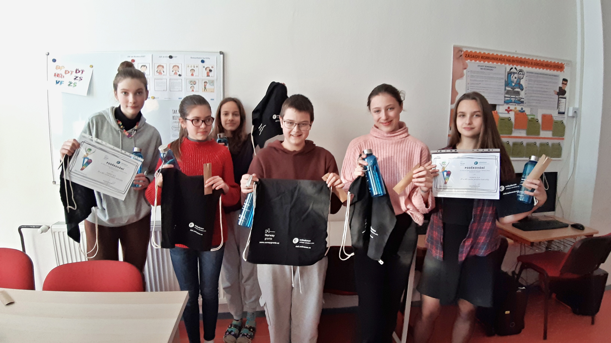

Jednali s ředitelkou školy i původní paní prodavačkou. Bohužel zjistili, že prostory bufetu musely ustoupit novým potřebám školy a školní bufet tak není možné obnovit.  

Odvážná skupina se však nevzdala a vydala se na místní obecní úřad. Tam zvládla vyjednat změnu jízdního řádu pojízdné prodejny, která začala zastavovat i před jejich školou. Bohužel ani to nebylo ideální a hukvaldští si musí svačiny dál nosit z domu nebo koupit po cestě do školy.

Přesto nám hukvaldští osmáci Zuzka, Honza a Vendula napsali pozitivní zpětnou vazbu. 

***"Díky tomuto projektu jsme se naučili jednat s úřady a poznali jsme problémy ostatních škol."***

Součástí naší soutěže bylo i [online setkání](https://deti.ochrance.cz/aktualne/zkusme_to_zmenit/), v rámci kterého si představily skupiny z různých škol své projekty. Navzájem si také radily, co a jak mohou ještě udělat, případně jak funguje daná věc v jejich škol. 

Zástupci hukvaldského žákovského parlamentu nás navštívili i v naší kanceláři v Brně. Na fotky z jejich návštěvy můžete kouknout na [jejich Facebooku](https://www.facebook.com/media/set/?set=a.684952596966462&type=3). 

**Hukvaldští, díky za Vaši aktivitu i návštěvu!**

> Soutěž a online setkání participační skupiny jsme uskutečnili v rámci projektu Posílení aktivit veřejného ochránce práv v ochraně lidských práv (směrem k ustavení Národní lidskoprávní instituce v ČR), číslo projektu LP-PDP3-001. Projekt je součástí Programu lidská práva financovaného z Norských fondů 2014-2021 prostřednictvím Ministerstva financí.