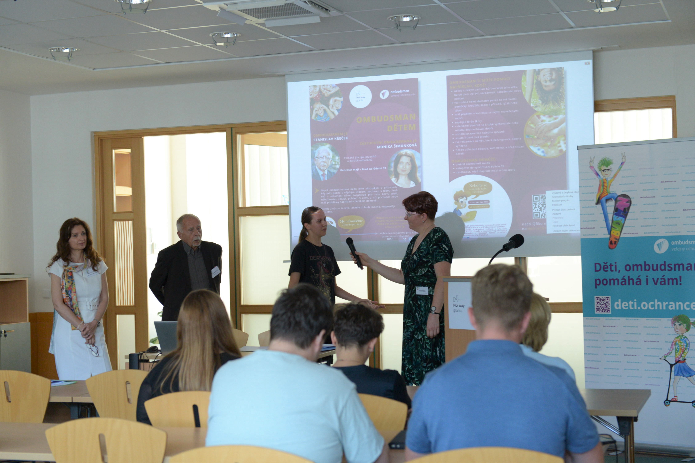

**Než to všechno vypuklo:**

**Vystavili jsme všechna díla, se kterými děti soutěžili o účast na konferenci:**

**Zahájení konference** – **děti se dozvěděly, co ombudsman a jeho zástupkyně dělají a kde mohou pomáhat:**

**Po oficiálním zahájení čekal děti program v podobě drama lekce. Aktivně vymýšlely, jaké situace je trápí, kde mohou být více aktivní a na koho se v případě problémů mohou obracet. Zkusily si také vytvořit svého dětského ombudsmana a vyzkoušely si, jaké to je mu klást otázky.** 

**Na konferenci jsme pozvali také poslankyně a poslance, zástupce z ministerstev a Výboru pro práva dítěte. Samostatně jsme s nimi diskutovali o potřebě zřídit dětského ombudsmana, který v České republice chybí.**

**Samostatně jsme jednali také s učitelkami a učiteli, kteří děti doprovodili na konferenci. Nasdíleli jsme si tipy, jak s dětmi mluvit o ombudsmanovi a o důležitosti zapojení dětí do věcí, které se jich přímo dotýkají.** 

**Děti se zapojily také do tiskové konference, na které jsme mimo jiné prezentovali, co vše děláme pro děti:**

**Všechny děti zaujaly ponožky pana ombudsmana:**

**Hlavní částí konference byla diskuze dětí s ombudsmanem a jeho zástupkyní:**

**Velký zájem byl i o skupinové fotky s ombudsmanem nebo o prohlídku jeho kanceláře:** 

**Na závěr konference jsme děti vzali na exkurzi nedalekého Ústavního soudu:**

**Tiskovou zprávu o konferenci pro děti můžete zhlédnout také ve znakovém jazyce:**

<iframe width="560" height="315" src="https://www.youtube.com/embed/7joyhC2pDgQ" title="YouTube video player" frameborder="0" allow="accelerometer; autoplay; clipboard-write; encrypted-media; gyroscope; picture-in-picture" allowfullscreen></iframe>

*Konference pro děti a tisková zpráva byly realizovány v rámci projektu Posílení aktivit veřejného ochránce práv v ochraně lidských práv (směrem k ustavení Národní lidskoprávní instituce v ČR), číslo projektu LP-PDP3-001. Projekt je součástí Programu lidská práva financovaného z Norských fondů 2014-2021 prostřednictvím Ministerstva financí.*