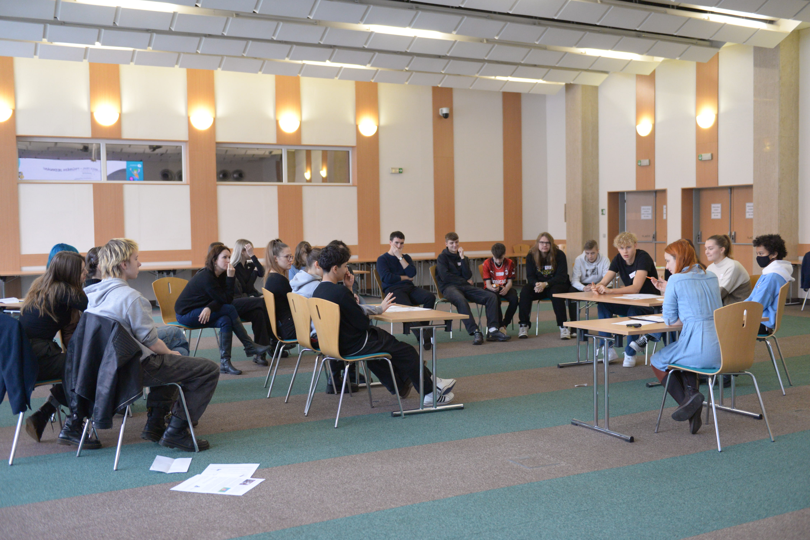
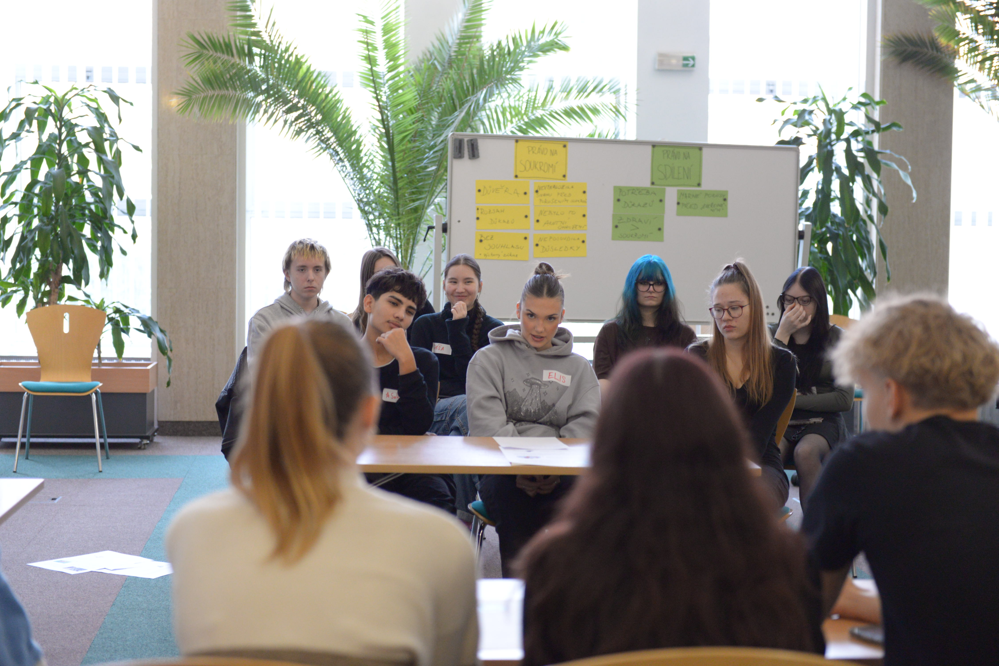
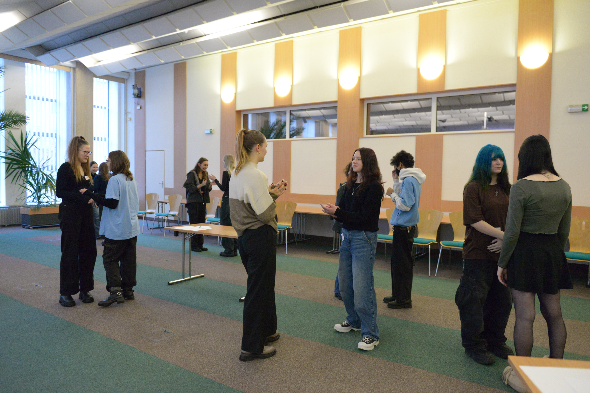
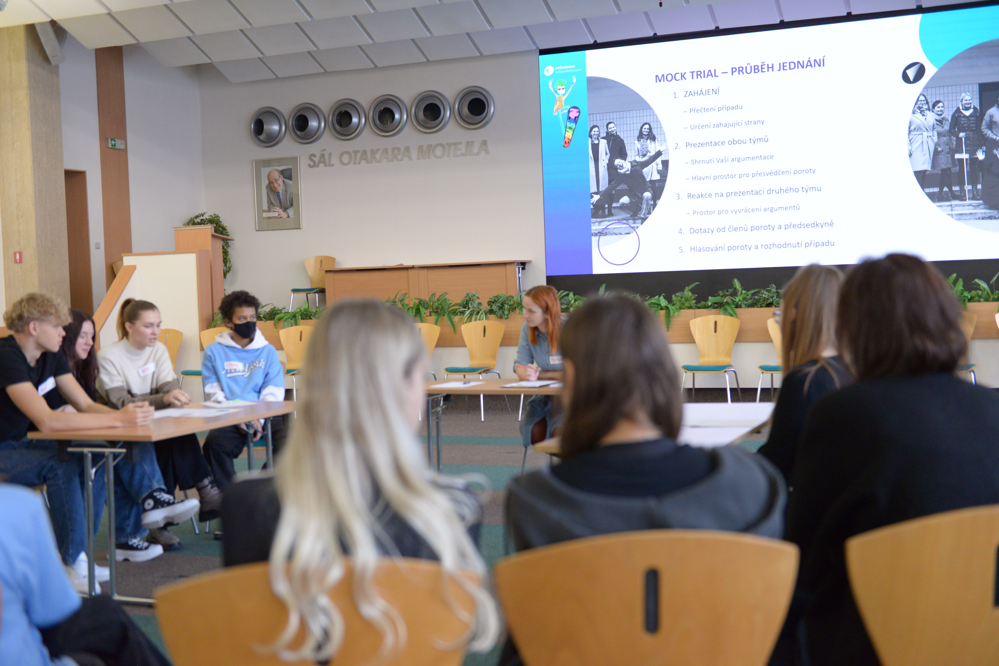
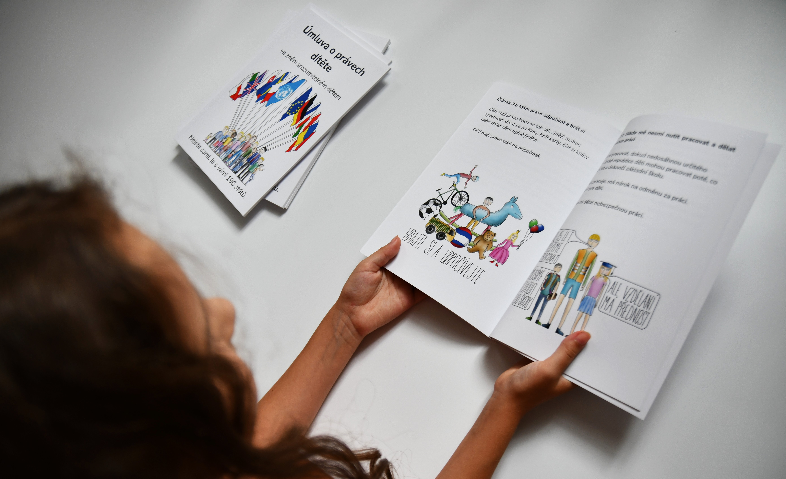

Další středoškoláci si u nás vyzkoušeli, jak často může docházet ke střetu práva na soukromí s právem sdílet informace. V simulovaném soudním řízení museli své názory přednést i uhájit. A dařilo se jim skvěle!

Není jednoduché prosazovat názor, se kterým nejste zcela ztotožnění. I tuhle výzvu však brněnští středoškoláci zvládli skvěle. 

> Setkání (participační skupinu) jsme uspořádali v rámci projektu Posílení aktivit veřejného ochránce práv v ochraně lidských práv (směrem k ustavení Národní lidskoprávní instituce v ČR), číslo projektu LP-PDP3-001. Projekt je součástí Programu lidská práva financovaného z Norských fondů 2014-2021 prostřednictvím Ministerstva financí.

**Setkáním jsme si připomněli i výročí přijetí Úmluvy o právech dítěte. Tak koukni na [znění srozumitelné dětem](http://deti.ochrance.cz/umluva), které jsme připravili.**

