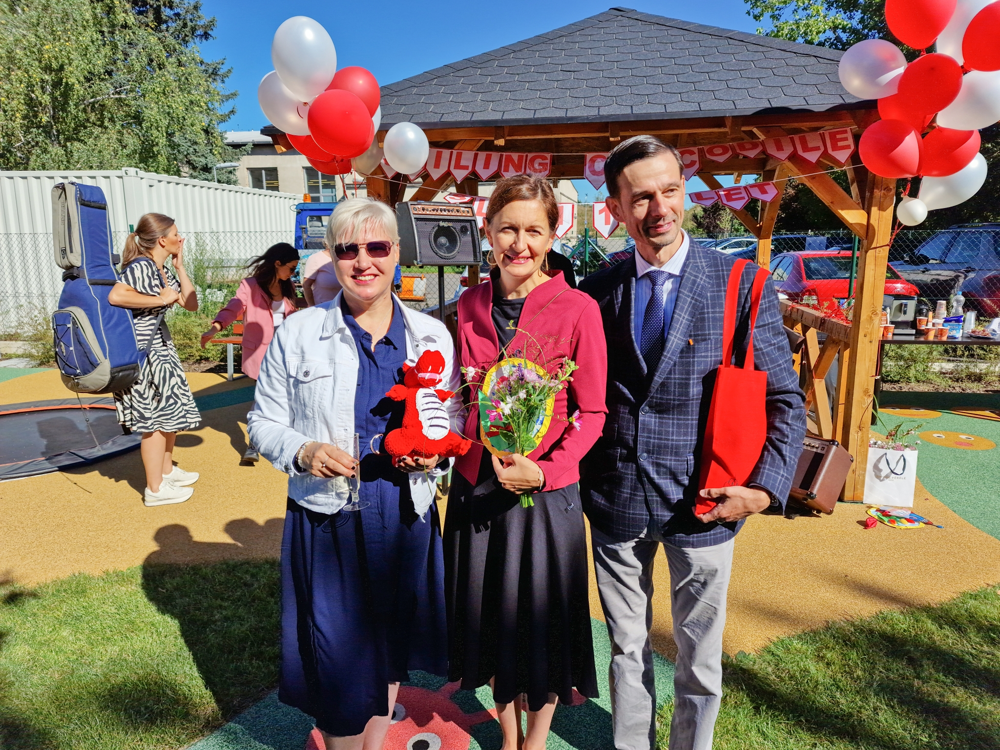
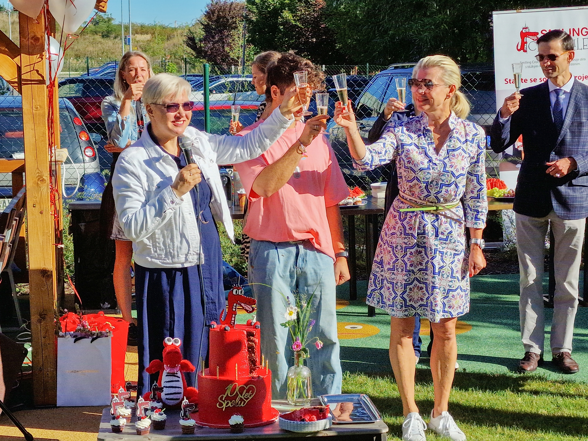
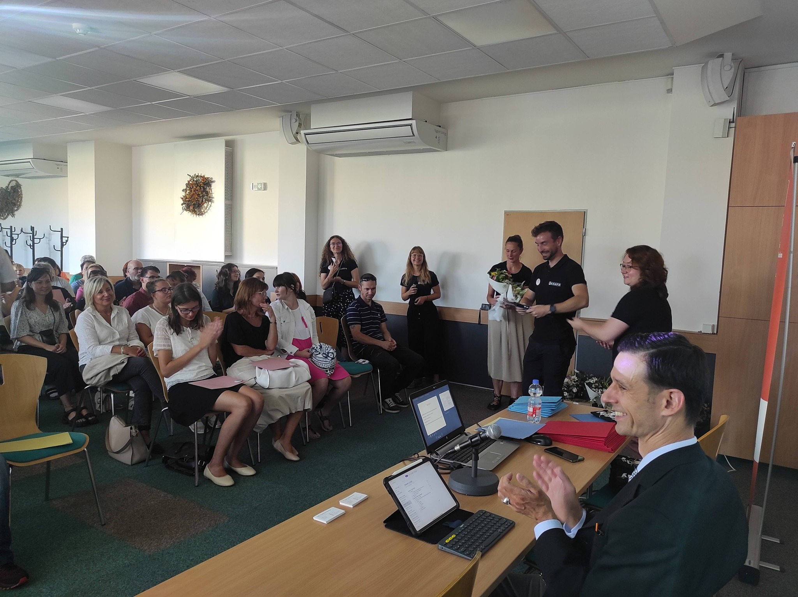
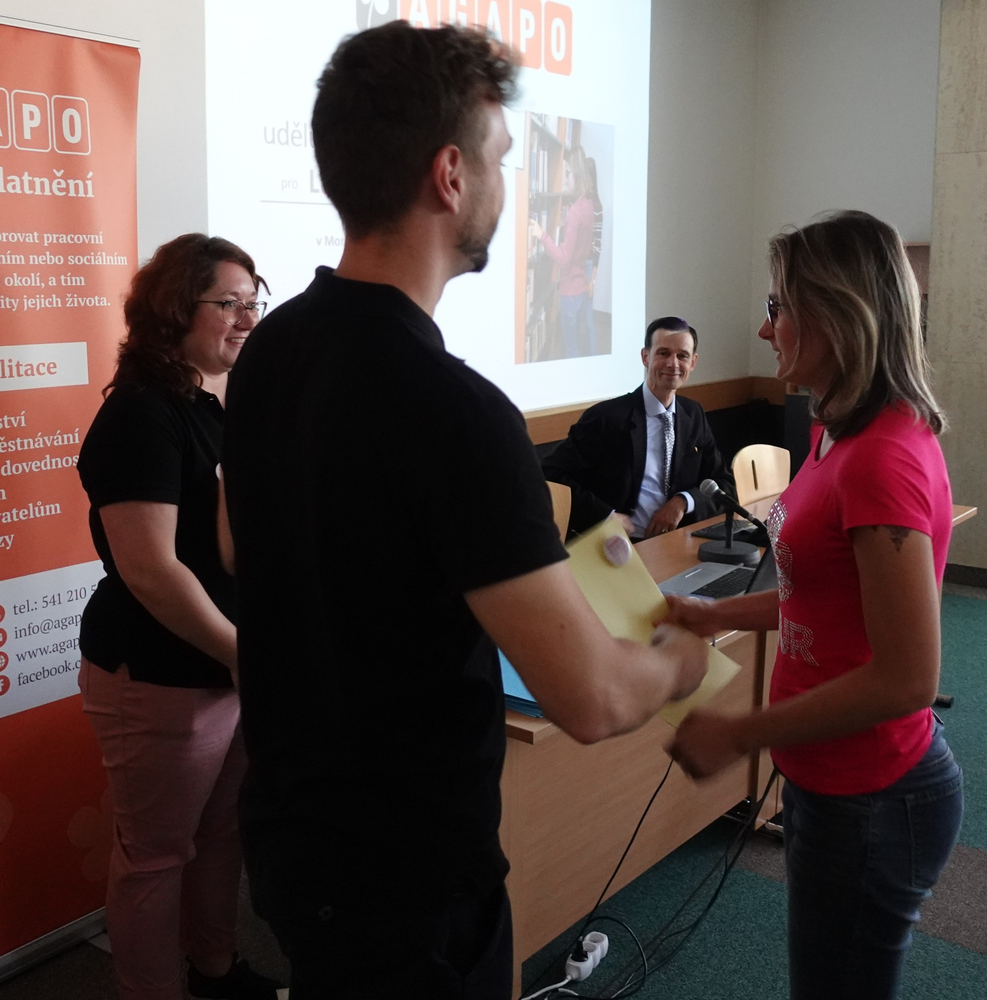

I proto zástupce ombudsmana Vít Alexander Schorm včera symbolicky zahájil nový školní rok v jedné z pražských škol pro děti s kombinovaným postižením. 

Zúčastnil se také předávání osvědčení úspěšným absolventům Tranzitního programu společnosti [Agapo](https://www.facebook.com/agapo.cz) "Ze školy do práce". V rámci toho mohlo osmadvacet jihomoravských středoškoláků celý rok chodit na praxi k některému z dvaceti zaměstnavatelů v regionu. Díky stážím si mladí lidé se speciálními vzdělávacími potřebami vyzkoušeli, jak to chodí v práci. Učili se samostatně plnit pracovní povinnosti, komunikovat, řešit nové situace a spolupracovat s kolegy. Zaměstnavatelé si zase ověřili, že díky stážím je přechod do práce snazší nejen pro budoucí zaměstnance, ale právě i pro společnosti, které je zaměstnají. 

