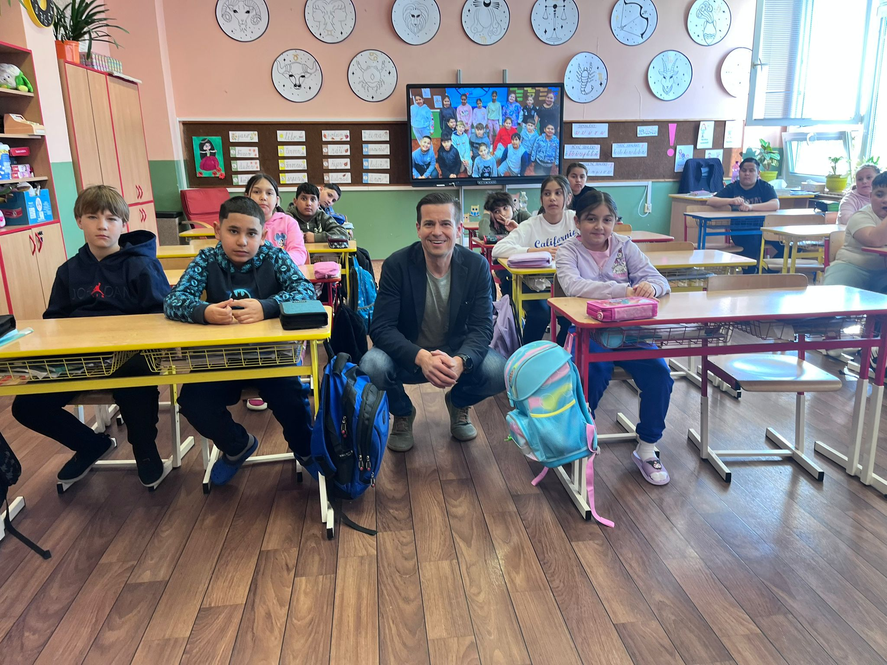

Někdy jezdí potají, jindy o sobě dá vědět. Kromě ohlášených návštěv, při kterých se dětský ombudsman seznamuje s dětmi, vyráží on a jeho tým také do dětských domovů a výchovných ústavů a dalších zařízení potají. Cílem je zjistit, jak se tam dětem vede, jestli se k nim vychovatelé dobře chovají a dodržují jejich práva.

Pobýváš v dětském domově, výchovném ústavu, jsi na psychiatrii nebo na jiném místě, odkud nemůžeš snadno odejít? Máš pocit, že to tam nefunguje správně? Ozvi se nám: deti@ochrance.cz.

