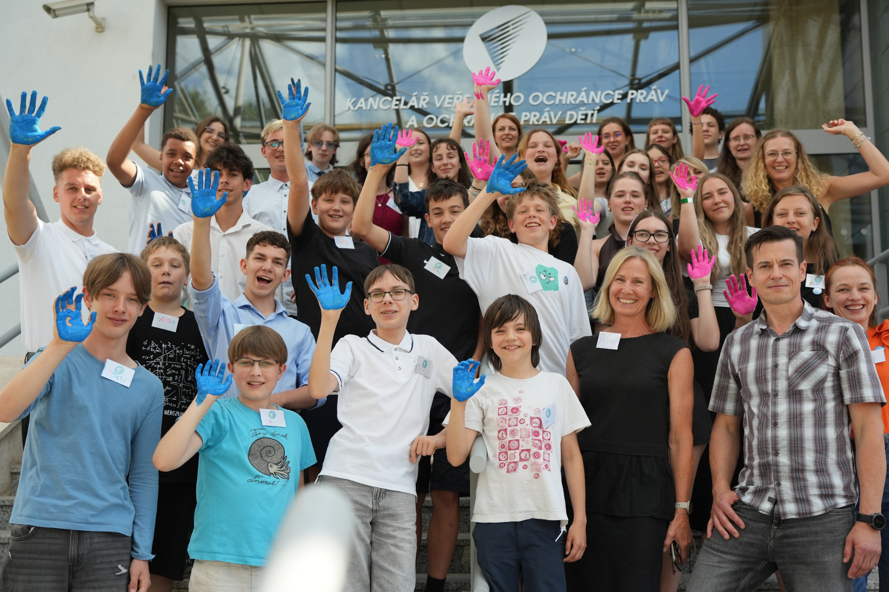

*„Dětský ombudsman by měl naslouchat dětem a dostat jejich názor do veřejného prostoru. Děti nikdo nebere vážně. Je to nespravedlnost. Chceme, aby se tento přístup k nám změnil,“* myslí si členové poradního týmu dětského ombudsmana.  Za tři roky společného setkávání by si přáli vyřešit aspoň jeden zásadní problém, který se jejich vrstevníků týká – třeba nároky ze strany škol, témata ochrany dětí, nedostatky v péči o duševní zdraví, snadnou dostupnost drog nebo rizika sociálních sítí a závislost na nich.

Chtějí být užiteční, potkávat inspirativní lidi jako jsou někteří influenceři a mluvit o problémech dětí s politiky a třeba i se šéfy organizací jako je CERMAT. A jak zatím fungují? *„Každý je tu jiný a to se mi líbí. Je tu skvělý kolektiv, který byl dobře vylosovaný,“* shodli se členové týmu. 

Poradní tým se znovu sejde po letních prázdninách. Jeho členové se tentokrát zaměří na tvoření pravidel toho, jakým způsobem spolu budou pracovat.

