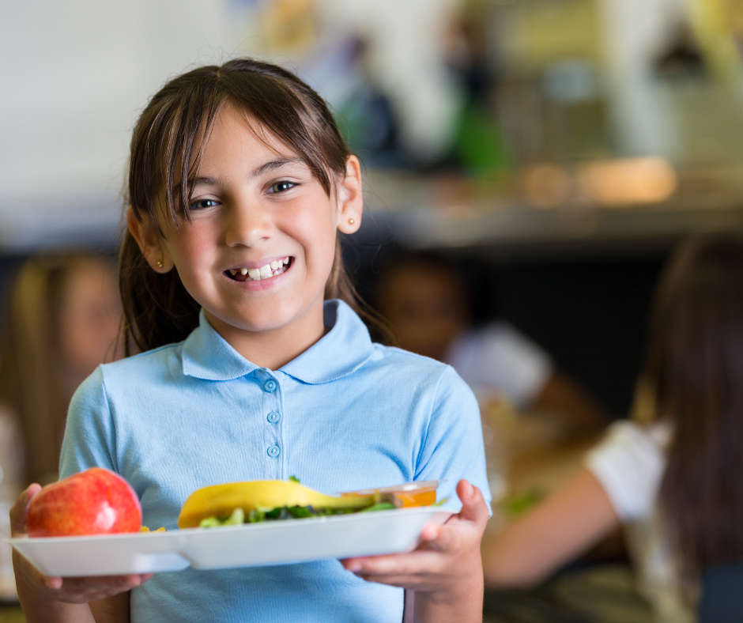

I když jsme se snažili, aby školní jídelny musely vařit jídlo i pro děti se speciální dietou, nepovedlo se to. Jídelny takové jídlo sice zajistit mohou, ale je to pro ně dobrovolné. My si však myslíme si, že by to pro ně mělo být povinné.

Proto o tom znovu mluvíme. Chceme, aby se ministerstva školství a zdravotnictví pravidly o školním stravování znovu zabývala a pomohla situaci zlepšit.

Zkrátka a jednoduše prosazujeme, aby si všechny děti se zdravotní dietou mohly ve škole jídlo objednat a dobře se tam najíst.

> ## Jak se změnila (některá) pravidla o školním stravování?
>
> ### Tohle je super:
>
> Než začala platit nová pravidla, školy a školky nebyly jisté, jestli mohou dětem dovolit sníst si v jídelně vlastní jídlo, když si ho přinesou z domova. Teď už ví, že ano.
>
> ### Tohle se nám nelíbí:
>
> Jídelny nemusí zajistit speciální jídlo pro děti se zdravotním omezením (například když potřebují bezlepkovou dietu).
>
> Když si děti přinesou vlastní jídlo, nemusí jim nikdo pomáhat s jeho uskladněním (třeba zajistit ledničku) nebo s tím, aby měly jídlo ohřáté.

