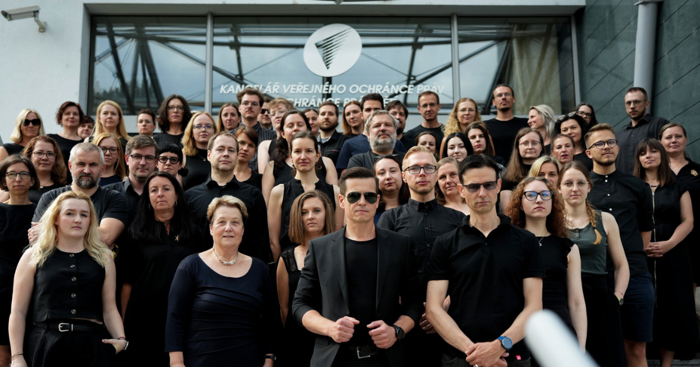

Vláda navrhuje, aby se financování přesunulo z lidí na stát. To může znamenat míň pořadů pro tebe a větší tlak politiků. Proti tomu se dneska postavili zaměstnanci televize a rozhlasu. Omezují vysílání, aby dali najevo, že s návrhem nesouhlasí. My jsme se k nim připojili tím, že jsme si do práce oblékli černou barvu. Protože veřejnoprávní média mají podle nás sloužit veřejnosti.

