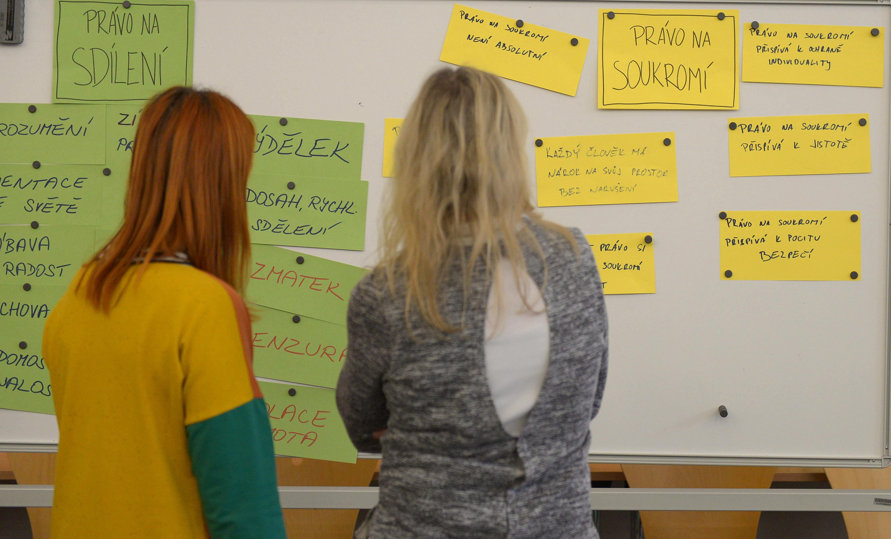
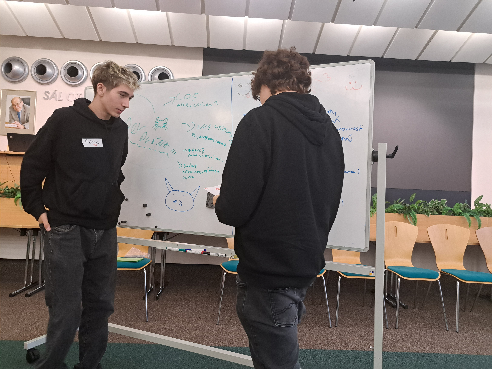
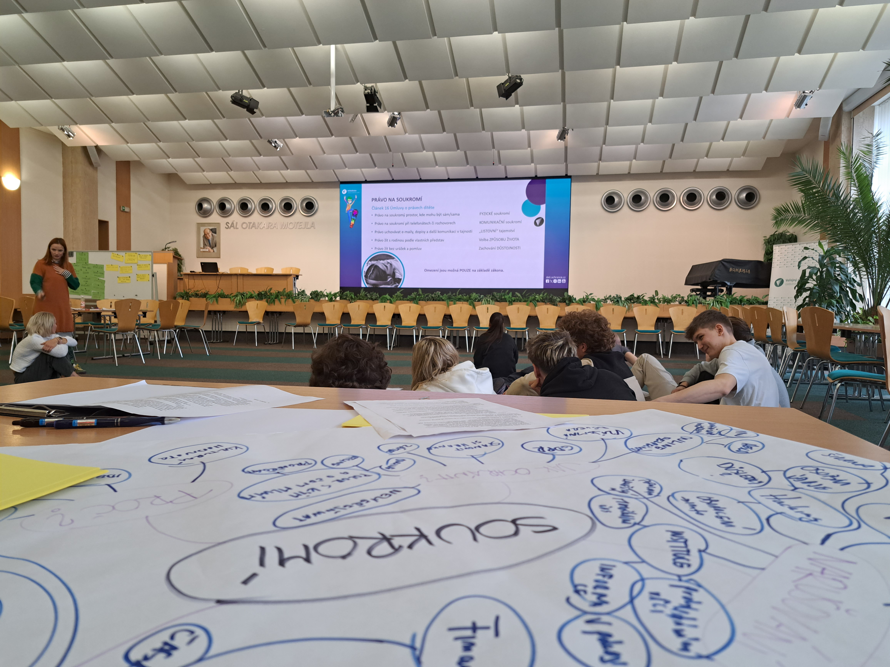
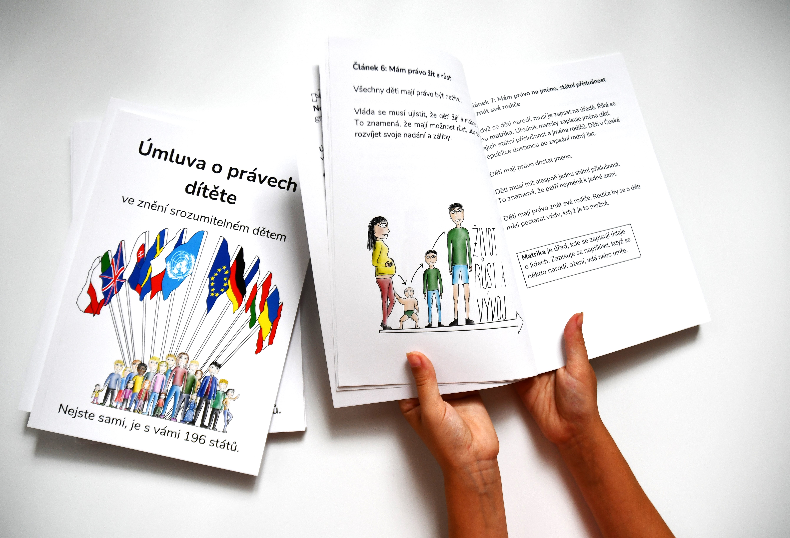

Jak jak to vypadalo?

**Připomínáme si tím mimo jiné výročí přijetí Úmluvy o právech dítěte. Tak koukni na [znění srozumitelné dětem](http://deti.ochrance.cz/umluva), které jsme připravili.** 

> Setkání (participační skupinu) jsme uspořádali v rámci projektu Posílení aktivit veřejného ochránce práv v ochraně lidských práv (směrem k ustavení Národní lidskoprávní instituce v ČR), číslo projektu LP-PDP3-001. Projekt je součástí Programu lidská práva financovaného z Norských fondů 2014-2021 prostřednictvím Ministerstva financí.