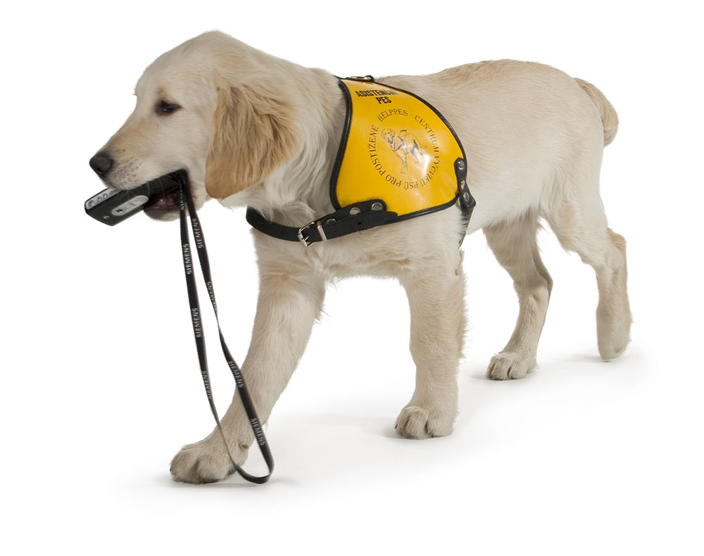

Emě jsme vysvětlili, že vstup asistenčního psa do domova mládeže není zmíněný v žádném konkrétním zákoně. Existuje však antidiskriminační zákon, který zakazuje diskriminaci z důvodu zdravotního postižení. A její onemocnění by za zdravotní postižení mohlo být považováno.

Pokud by ředitel školy vstup asistenčního psa do domova mládeže zakázal, mohlo by jít o diskriminaci. Ale není to možné dopředu jednoznačně říci. Záleží totiž na konkrétní situaci. Kroky ředitele musí být přiměřené, zohledňovat konkrétní možnosti internátu a také ostatní ubytované. Problém by mohli mít třeba spolužáci alergičtí na psí srst. Důležité je proto hledat možnosti řešení a případný zákaz podrobně zdůvodnit.

Ema udělala dobře, že již možnosti řešení probrala s hlavní vychovatelkou internátu. Společně vymyslely, že by Ema mohla mít pokoj v přízemí blízko vchodu do domova, vlastní povlečení a že by internát ke vchodu umístil hadr na otírání psích tlapek.

Emě jsme doporučili, aby situaci probrala s ředitelem školy a zmínila možná řešení, která projednala s hlavní vychovatelkou. Pokud by ředitel školy trval na zákazu, měl by to Emě podrobně zdůvodnit. Ema by se následně mohla obrátit na [Českou školní inspekci](https://csicr.cz/cz/Clanky/Jak-podavat-stiznosti). O posouzení by mohla požádat také [nás](https://deti.ochrance.cz/o-nas/jak/). Vyhodnotili bychom, zda podle nás došlo k diskriminaci, a na základě toho Emě doporučili další možnosti řešení – například zda je vhodné, aby podala žalobu k soudu nebo se pokusila dospět k dohodě formou mediace.

