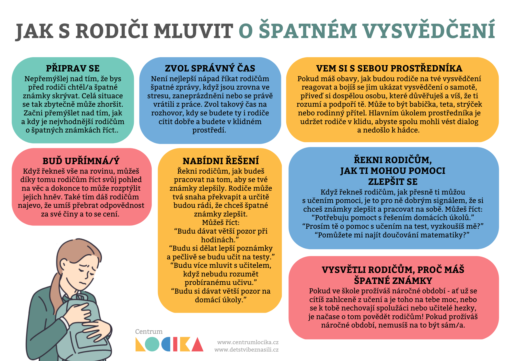

Věříme, že nálada ve tvé třídě byla při dnešním předávání vysvědčení stejně uvolněná jako u kluků, kteří se s námi podělili o fotku.

### Tvé pololetní výsledky nejsou zrovna k oslavě? 

Pokud letošní vysvědčení nedopadlo nejlépe, možná přemýšlíš, jak o tom mluvit s rodiči? Zkus se inspirovat radami, které připravilo [Centrum LOCIKA](https://www.centrumlocika.cz/).

### **Doma se přesto necítíš v bezpečí nebo tě rodiče přísně potrestali?**

**Neboj se podělit o své pocity. Existuje mnoho možností, ze kterých si můžeš vybrat:** 

* svěř se někomu blízkému ze svého okolí,
* napiš na chat poradny [Dětství bez násilí](https://www.detstvibeznasili.cz/jsem-dite-nebo-teenager), 
* zavolej na některou z [linek důvěry](https://deti.ochrance.cz/pomoc/linky/),
* spoj se se sociálními pracovnicemi či pracovníky OSPOD ve tvém městě (najdeš je na městských úřadech, úřadem městských částí či obvodů).