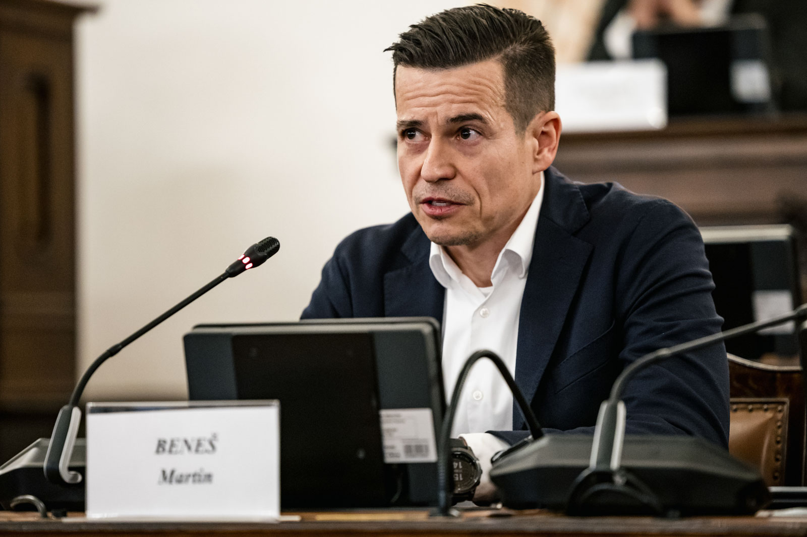

Martin Beneš plánuje jako dětský ombudsman pracovat na tom, aby všechny děti v Česku mohly žít bezpečně a spokojeně. A aby měly pomoc po ruce vždy, pokud se to nedaří.

Chce, aby mohly chodit do dobré školy, dostat se k doktorovi, když to potřebují, a měly bezpečný domov.

Bude se taky věnovat tomu, jak zajistit, aby dětské domovy, výchovné ústavy a další místa, kde děti někdy musí žít, fungovaly co nejlépe.

Zaměří se i na duševní zdraví dětí a mladých lidí a na to, jak ho podporovat, aby se cítili dobře.

