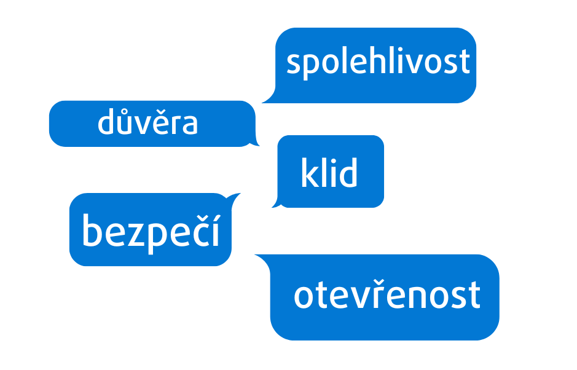
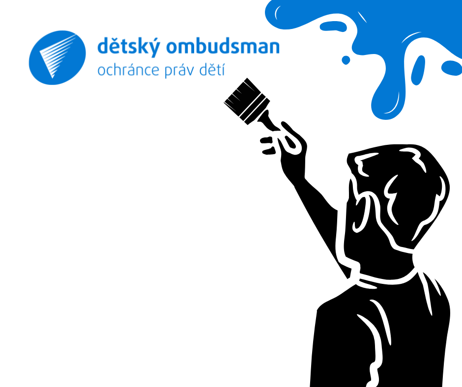

Chceme být spojováni s pocity, které modrá barva představuje – spolehlivost, důvěra, klid, bezpečí a otevřenost. Občas přidáme i růžovou. Ta značí empatii, ochranu a péči.

Logo bude mít dětský ombudsman stejné, jako ombudsman „dospělácký“. Ten jej však bude mít ve své zelené, která ho doprovází už 25 let. Je to ochranné křídlo.

