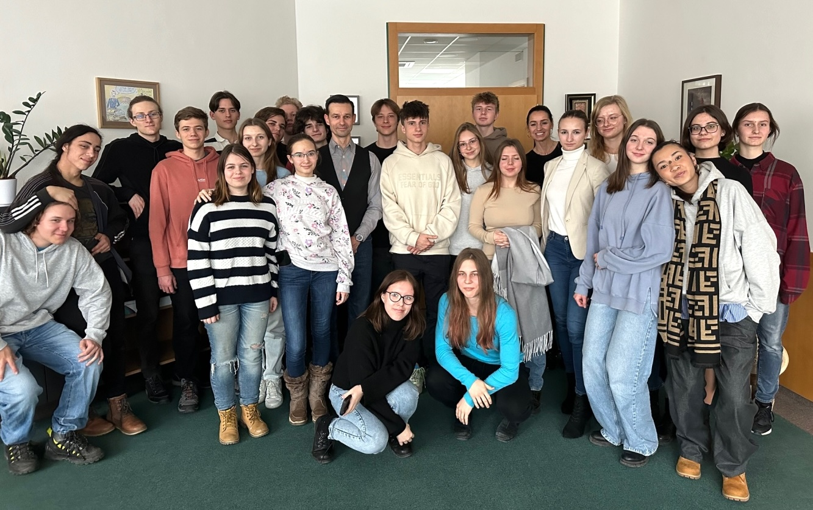
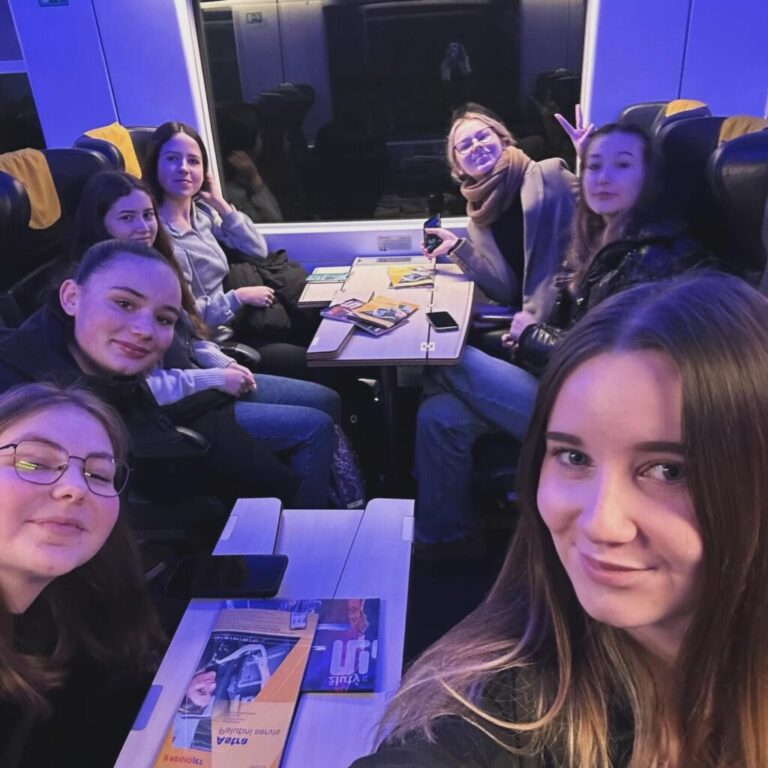

Jako jedni z posledních nás navštívili druháci z nedaleké střední školy. S jakými dojmy odcházeli se můžete dočíst na [jejich webu](https://www.jaroska.cz/node/1995). 

Pravidelně se k nám vrací také nebrněnské školy. O svých zážitcích z výprav za poznáním pravidelně píše třeba střední odborná škola z Pardubic. Jejich reportáže najdeš na jejich webu. Zavítali k nám například v [březnu loňského roku](https://labskaskola.cz/navsteva-kancelare-verejneho-ochrance-prav/) a stihli to už i [letos](https://labskaskola.cz/odborna-exkurze-do-kancelare-verejneho-ochrance-prav/). 

> ### **Náš tip:**
>
> **Co spojit návštěvu naší kanceláře s dalšími zajímavými místy v Brně? Můžete se inspirovat třeba u studentů z [Poličky](https://www.gympolicka.cz/aktuality/profesni-zsv-si-rozsirilo-obzory-na-exkurzi-v-brne/) nebo [Znojma](https://www.gpoa.cz/pro-studenty-a-rodice/ostatni-clanky-aktualniho-skolniho-roku/2306-exkurze-brno).**