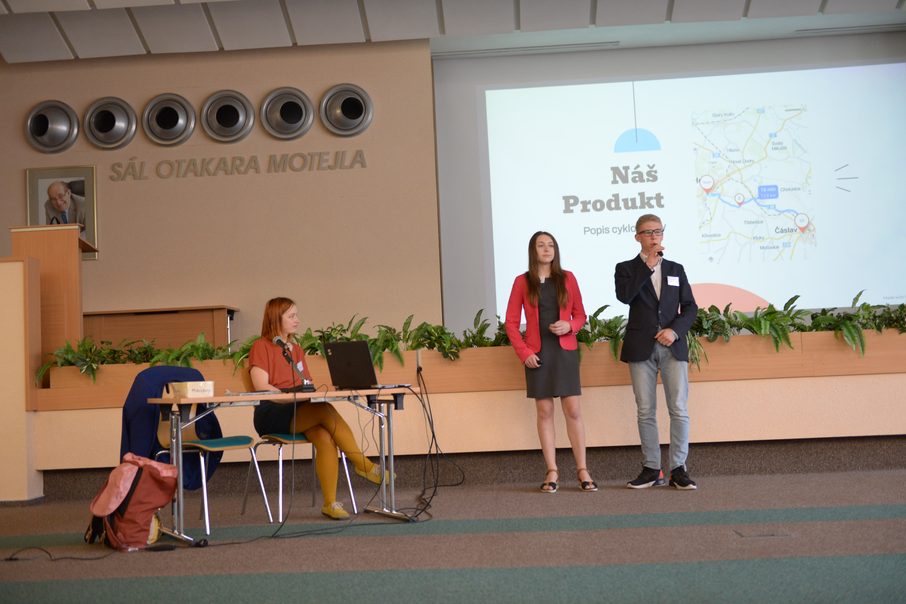

*„K našemu projektu mě vedla osobní motivace. Ráda bych jezdila na kole do školy a měla i možnost navštěvovat své přátele v sousedním městě bez toho, že bych byla závislá na veřejné dopravě nebo mě museli vozit rodiče,“* popisuje studentka [čáslavského gymnázia](https://www.facebook.com/gymcaslav.cz) Nicole, proč se spolužákem Michalem v ombudsmanské soutěži navrhli propojení Čáslavi a Kutné Hory cyklostezkou. *„Situace je nejhorší hlavně o víkendu, kdy autobusy nejezdí, takže pokud bydlíte v jedné z menších vesnic bez přístupu k vlaku, jste zcela závislí na rodičích nebo jiných dospělých,“* přitakává druhák Michal.

*O cyklostezce už oba gymnazisté jednali s čáslavským starostou a oslovili také některé majitele pozemků. Věří, že jejich nápad má šanci uspět, ale zároveň chápou, že samotná příprava a stavba je především v rukou úředníků a politiků. Za svou práci dostali dnes zvláštní cenu poroty za nejambicióznější projekt soutěže.*

Ocenění za důkladné zmapování tématu anketou si odnesla trojice studentů [gymnázia z Velkého Meziříčí](https://www.facebook.com/gymplvm). Ti si dali za cíl varovat své vrstevníky před riziky jednorázových e-cigaret. Z 290 vyplněných dotazníků například zjistili, že velká část oslovených sedmáků a deváťáků už má osobní zkušenost s kouřením e-cigaret.

*„Všechny prezentace jasně potvrdily, že mladí lidé na prahu dospělosti dokáží přemýšlet o tom, co by se mělo v jejich okolí zlepšit. Já bych jim moc přál, aby se jim povedlo jejich projekty úspěšně dotáhnout do konce*,“ ocenil zástupce ombudsmana Vít Alexander Schorm.

Každý ze sedmi pozvaných týmů měl dnes na prezentaci svého projektu pět minut. Krátký časový limit spolu s anglickým výrazem Elevator v názvu soutěže odkazuje na schopnost člověka přesvědčit náhodného spolucestujícího během krátké cesty výtahem , aby investoval do jeho nápadu. 

Ombudsman studentům sice nemůže poskytnout přímo peníze, ale on i jeho zástupce nabídli studentům osobní podporu a pomoc například při jednání s úřady: *„Můžeme je také propojit s těmi správnými lidmi, kteří studentské nápady pomohou změnit v realitu,“* přiblížil ombudsman Stanislav Křeček.

Dnešní setkání je další z řady ombudsmanských aktivit zaměřených na děti a mladé lidi. *„Vloni v červnu jsme uspořádali první [dětskou ombudsmanskou konferenci](https://deti.ochrance.cz/aktualne/jak_to_vypadalo_na_nasi_konferenci/) pro žáky druhého stupně základních škol. Na podzim jsme pak [požádali](https://deti.ochrance.cz/aktualne/zkusme_to_zmenit/) osmáky a deváťáky, aby navrhli, co by chtěli změnit na svých školách. Se středoškolskými studenty jsme se teď posunuli ještě dál - podmínkou soutěže Elevator: nápadem to začíná bylo, aby se projekty zaměřily na výzvy mimo školu,"* popsala právnička naší Kanceláře Barbora Jechová.

*„Dlouhodobě vnímáme potřebu zapojit děti a mladé lidi do života kolem nich. Proto se aktivně snažíme naslouchat jejich nápadům a následně je prosazovat i v naší práci. Věřím, že tento úkol časem převezme [dětský ombudsman](https://www.ochrance.cz/aktualne/ustavne_pravni_vybor_poslanecke_snemovny_na_setkani_s_ombudsmanem_a_jeho_zastupcem_v_brne_diskutoval_o_planech_na_zrizeni_detskeho_ombudsmana_nebo_o_zapojovani_spolku_do_rizeni_o_povolovani_staveb/),“* vysvětlila Petra Šuplerová, která v naší Kanceláři vede odbor rodiny, zdravotnictví a práce.

Studenti také konzultovali své nápady s právníky naší Kanceláře a pozvanými odborníky třeba z:

* [Informačního a edukačního centra Masarykova onkologického ústavu,](https://www.mou.cz/informacni-a-edukacni-centrum/t1479)
* [Brno na kole](https://brnonakole.cz/o-nas/), 
* [Domu zahraniční spolupráce](https://www.dzs.cz/), 
* [Centra podpory podnikavosti](https://www.podnikavamysl.cz/cz/) z brněnské [Lipky](https://www.lipka.cz/) a
* [odboru participace Magistrátu města Brna](https://www.brno.cz/w/odbor-participace).

Inspiraci jsme nabídli také [pražským středoškolákům ](https://www.facebook.com/skolabean)se zahradnickým zaměřením. Vzali jsme je mimo jiné do [naší nové budovy, která získala v roce 2020 ocenění v soutěži Zelená střecha roku](https://www.zelenestrechy.info/green-roof/detail/78). Pražský studentský tým totiž usiluje o ozelenění parkovacího domu poblíž jejich školy. Mají v plánu ho osadit nejen popínavými rostlinami, ale také zajistit jejich výsadbu a údržbu. 

Nabídku exkurze v [Šuplig - charitativním obchodě Ligy Lidských práv](https://llp.cz/suplig/) zase využil [tým z Benešova](https://sousbn.cz/), který by rád zřídil charitativní obchůdek pro lidi v nouzi. 

Všechny projekty budeme dále sledovat a přineseme vám o nich zprávy.

> Vybrané týmy se zúčastnily dnešního setkání participační skupiny, kterou pořádáme v rámci projektu Posílení aktivit veřejného ochránce práv v ochraně lidských práv (směrem k ustavení Národní lidskoprávní instituce v ČR), číslo projektu LP-PDP3-001. Projekt je součástí Programu lidská práva financovaného z Norských fondů 2014-2021 prostřednictvím Ministerstva financí.