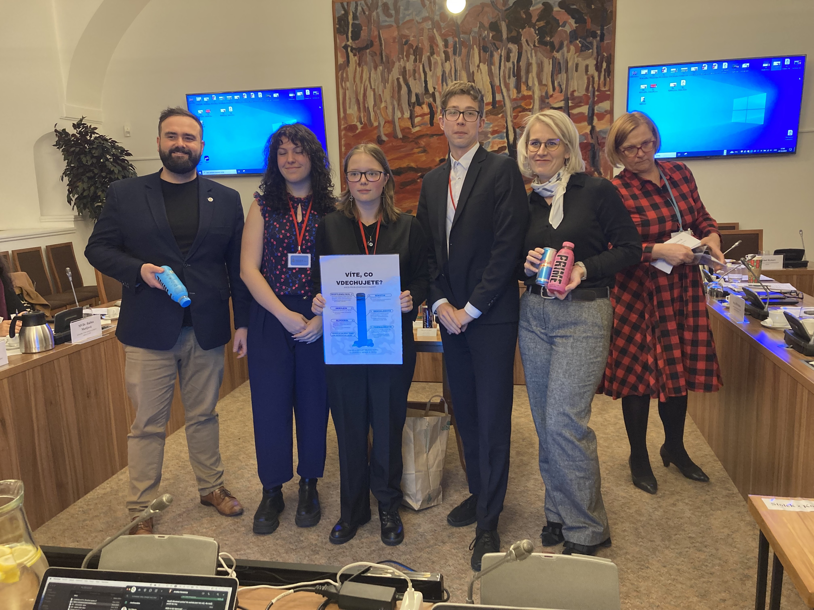
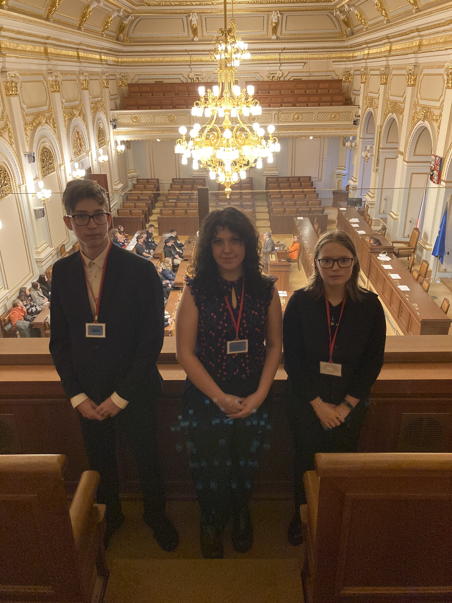
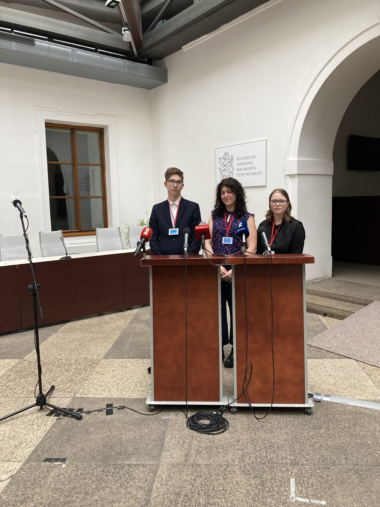
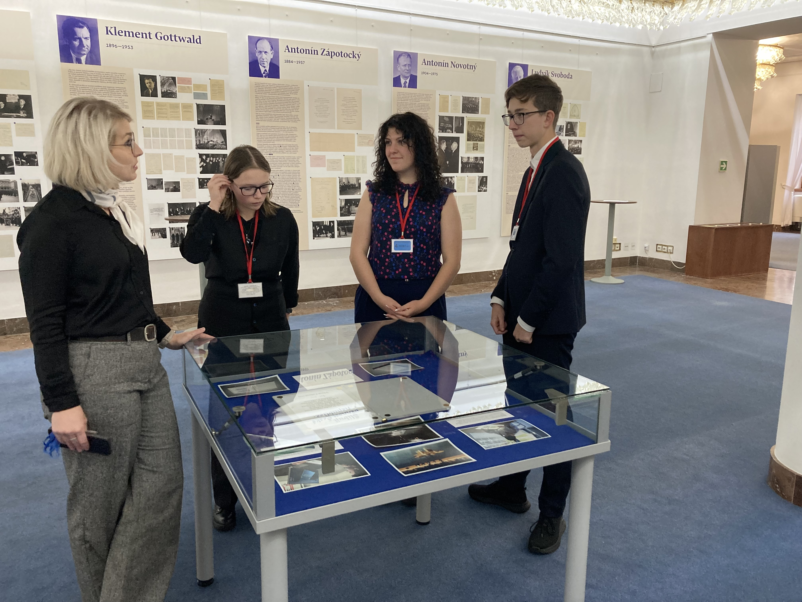

Obrovsky nás těší zprávy o projektech, kterým naše soutěž ***Elevator: nápadem to začíná*** otevřela cestu ke skvělé práci. 

V létě jsme shrnuli dosavadní cestu Adély, Anety a Standy v [reportáži](https://deti.ochrance.cz/aktualne/diky_nasi_soutezi_rozjeli_studenti_z_velkeho_mezirici_kampan_proti_e-cigaretam/). Ani po prázdninách ale na projekt nezanevřeli. Za podpory ředitelky školy vytvořili [prezentaci](https://drive.google.com/file/d/17e3YeQH2LQ6J9uOVagjkZeOFyOxGMmxt/view) nabytou fakty, videí i obrázky a nebáli se postavit před vrstevníky. Své dosavadní znalosti o škodlivosti e-cigaret shrnuli v 45 minutové přednášce.

Jejich projektu si všimla i [poslankyně Martina Ochodnická](https://www.facebook.com/lisova.starostka.ochodnicka.poslankyne/) a pozvala je na odborný kulatý stůl do Poslanecké sněmovny. Ten se věnoval podobnému tématu, konkrétně problematikou energetických nápojů u nezletilých. Trojice středoškoláků zde mohla svůj projekt představit a dostala nabídky na další spolupráci i mediální výstupy. 

**Gratulujeme a přejeme mnoho dalších úspěchů!**

> **A co nám ještě napsala Adéla?** 
>
> *Zároveň bych Vám chtěla poděkovat za vytvoření soutěže Elevator: nápadem to začíná, protože nás to posunulo někam, kam jsme vůbec nečekali. Moc děkujeme za takovou příležitost! Určitě Vás dále budu informovat o nadcházejících událostech a pokrocích.*

