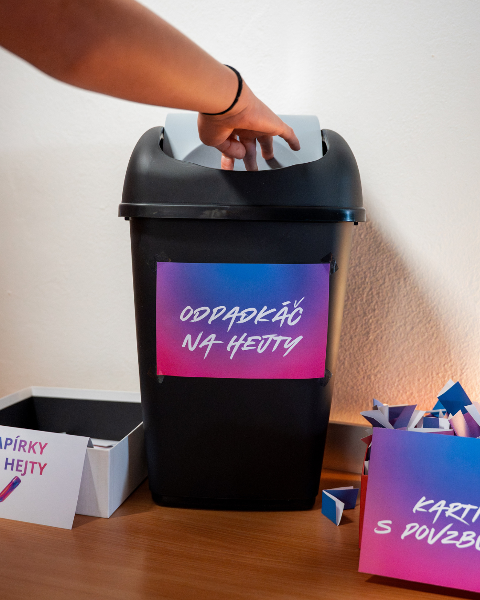

Proč lidi hejtují? Někomu připadá zábavné druhým ubližovat. Zvlášť pokud je sám v životě neúspěšný a nemá dost sebevědomí či odvahy. Nebo tě chce zmanipulovat. Cíleně využívá silné pocity. Případně se tě díky emocím snaží přidat na svojí stranu nenávisti. Nenechávej sebou manipulovat. Nevěnuj pozornost hejtrům. Pokud to jde, pošli je rovnou do koše a soustřeď se raději na sebe.

A co když nemáš odpadkáč? Nereaguj okamžitě. Nenech se zlákat silnými emocemi, na které hejtr útočí. Vidíš hejt na sítích? Nenávistný obsah je proti pravidlům sociálních sítí – příspěvek můžeš nahlásit, pokud je namířený proti lidem kvůli jejich původu, vyznání, genderu,… 

A pokud se hejt týká tebe, nebo jsi pod palbou spousty nenávistných komentářů, ozvi se! Můžeš klidně někomu, komu ve svém okolí věříš. Pokud nikoho takového nemáš, napiš do poradny: https://poradna.e-bezpeci.cz/.
