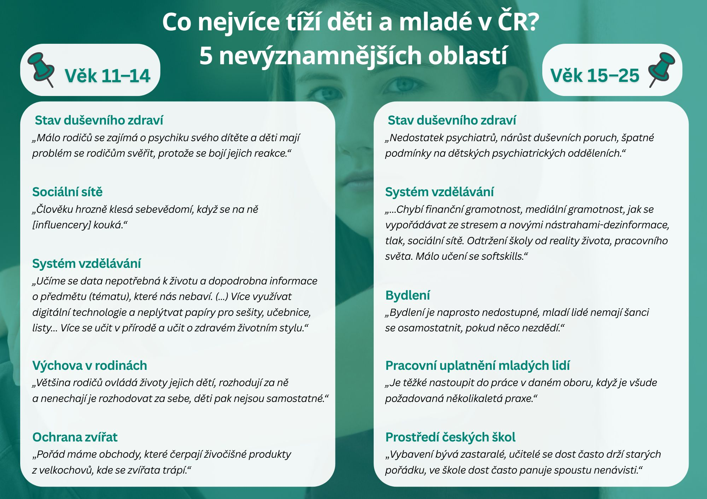

Děti a mladí dospělí často ukazují na psychické problémy, jako je deprese, sebepoškozování či nízké sebevědomí. Za zdroj potíží často označují školu, kde se cítí být přetěžováni. Někdy dokonce ve školním prostředí pociťují strach. Uvádějí, že ve škole jim často nikdo nenaslouchá a někdy podpora nepřichází ani ze strany rodičů. Psychologickou pomoc vnímají jako nedostupnou. Nabývají tak dojmu, že jejich problémy nikoho nezajímají.

>  *„Nedostatek péče, její nedostupnost. Bagatelizace – sněhové vločky, ‚za nás to bylo ...‘ od starší generace. Sociální sítě,“ tak* pojmenoval jeden z respondentů některé z příčin psychické nepohody mladých.

Podle názorů dětí a mladých dospělých nejsou minulostí ani frontální výuka, memorování a přetěžování ve škole. Školu a přístup učitelů pak považují jako častý zdroj obtíží. Nelíbí se jim ani to, co a jak se učí. Kritizují, že se učí látku, která je v praxi nevyužitelná a neaktuální. Často by uvítali větší digitalizaci vzdělávání. Řadě z nich také nevyhovuje přístup učitelů, který považují za zkostnatělý.

>  *„Stejný vzdělávací systém po stovky let, velký objem učiva, informace jsou dnes všude dohledatelný, místo toho aby se víc zaměřovalo na práci s technologií, zdravými návyky, stravování.“*

Zajímavé je, že mnoho dětí považuje za významný problém své generace také sociální sítě. 

### Co si o tom myslí zástupce ombudsmana, který bude dočasně zastupovat i dětského ombudsmana?

*„Většinu problémů mladé generace není snadné vyřešit. Je však důležité, že je umí přesvědčivě popsat. Na nás dospělých pak je, abychom děti a mladé nejen vyslyšeli, ale také je zapojili do hledání nejvhodnějšího řešení. To je jeden z důvodů, proč dětský ombudsman bude zřizovat svůj poradní orgán složený z dětí. Stejně tak vítám iniciativy řady ministerstev, která pozvolna usilují o zapojení dětí a mladých lidí do svých činností, například v podobě zřizování panelů pro mládež.“*