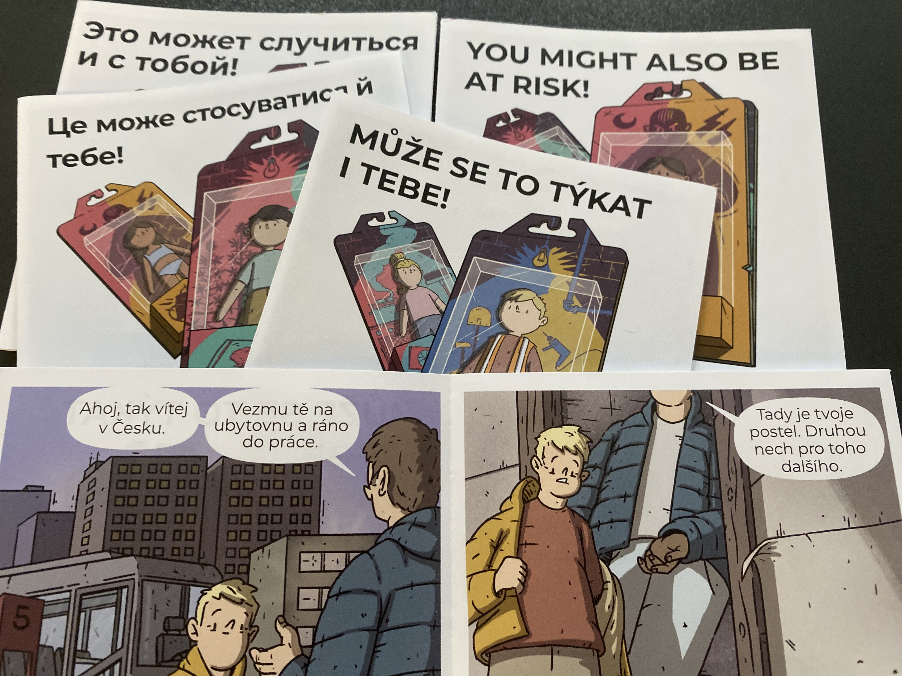

Děti z tvého sousedství, tvoje lékařka, řidič autobusu, který tě třeba vozí do školy... možná právě oni k nám přišli ze zahraničí. Lidé, které potkáváš a potřebuješ každý den.

Představ si, co někteří z nich mají za sebou. Jak těžké může být odcházet z domova, nechat tam rodinu a kamarády. Jaké to je, když někdo musí uprchnout kvůli válce. Jak náročné je přizpůsobit se novému prostředí, jazyku, zvyklostem. 

Někteří z těchto lidí však v nové zemi místo pomoci čelí vykořisťování. Často jsou mezi nimi děti. A tak vznikl nápad, jak dětem ukázat, na co si dát pozor. Výsledkem jsou komiksy s názvem „Může se to týkat i tebe“  které vytvořili studenti, s příběhy vycházejícími ze skutečných situací. 

Společně s organizací [La Strada ](https://www.strada.cz/hledam-informace/) je nyní budeme šířit mezi děti ohrožené vykořisťováním. 

> **Kdo je to migrant?**
>
> Člověk, kteří pobývá mimo zemi svého původu déle než jeden rok. Důvody, proč lidé odcházejí ze své země, můžou být různé: špatné životní podmínky, přírodní  katastrofa, snaha najít lepší práci, studium ...
>
> Chceš se dozvědět víc? Podívej se, co tomto tématu [říkají  naši kolegové](https://www.ochrance.cz/aktualne/pravnici_ombudsmana_ve_svem_videu_ukazuji_jak_je_to_s_migraci_v_cesku/) nebo si přečti informace na stránkách [Člověka  v tísni](https://www.clovekvtisni.cz/co-delame/migrace-v-souvislostech/migrace-pod-lupou).
>
> **Chceš zjistit podrobnosti o tom, co je to vykořisťování?**
>
> Podívej se na náš [leták](https://www.ochrance.cz/letaky/vykoristovani/vykoristovani.pdf).

