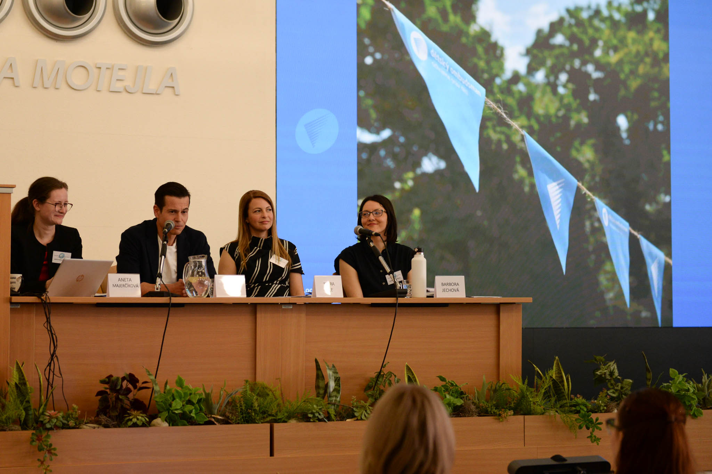
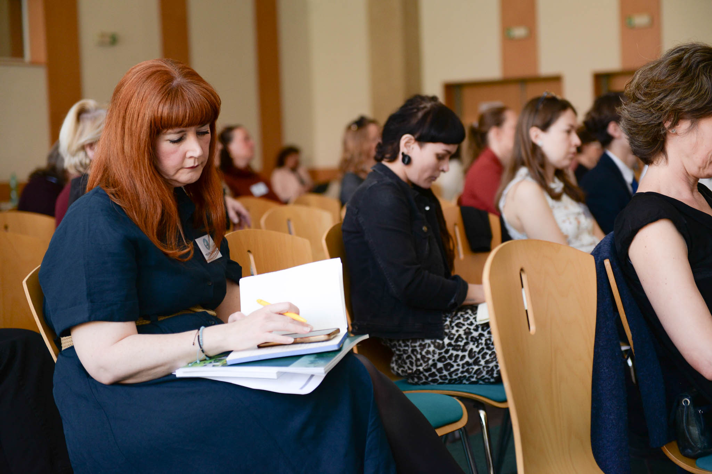
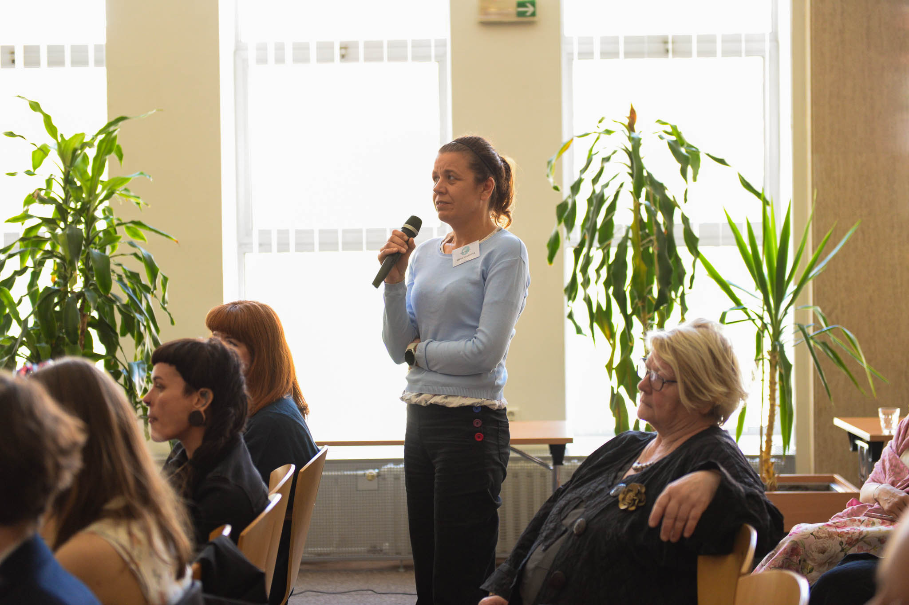

Přišli, či se připojili online lidé z více než stovky různých organizací věnujících se ochraně dětských práv. 

Každá z nich se věnuje trochu jiným tématům – někdo pomáhá dětem v rodinách, jiná se víc zaměřuje na školu nebo třeba na duševní zdraví. Všechny nás ale spojuje stejný cíl: aby se dětem žilo lépe a bezpečněji.

Mnoho organizací nám nabídlo pomoc a spolupráci. A to nám udělalo velkou radost. Určitě nové kontakty využijeme!

My jsme hostům na oplátku ukázali, na čem pracujeme už teď a co chystáme do budoucna. Témata, na která se chceme soustředit, vidí i oni jako důležitá. A jaká to jsou? Třeba ochrana dětí před násilím, duševní zdraví nebo
snadno dostupná pomoc pro děti.

A co dalšího naše hosty zaujalo? Že dětský ombudsman už brzy sestaví svůj dětský poradní tým. Ten by měla tvořit skupina dětí a teenagerů z různých prostředí. Myslíme i na to, aby v něm své zastoupení měly také děti se zkušenostmi v náročných situacích.  Všichni dohromady pak budou dětskému ombudsmanovi říkat své názory a pomáhat mu zjistit, která témata jsou pro děti ta vůbec nejzásadnější. 

>
> Sleduj náš web či sítě – už brzy se o dětském poradním orgánu dozvíš víc.
>

Zajímá tě setkání s neziskovkami víc? [Pusť si ho celé](https://youtube.com/live/Oop8PdcH6q0?feature=share&fbclid=IwZXh0bgNhZW0CMTAAYnJpZBExZm5wbjRQeEhoODY2M1NpTXNydGMGYXBwX2lkEDIyMjAzOTE3ODgyMDA4OTIAAR79r6P9Iav9fVsIQhAXCS0IsHelQ_igPVL07vwl0TEHIINGcHCtT7gojXzwbg_aem_Glhutqnxn5oyPNrpFvgyNw).

