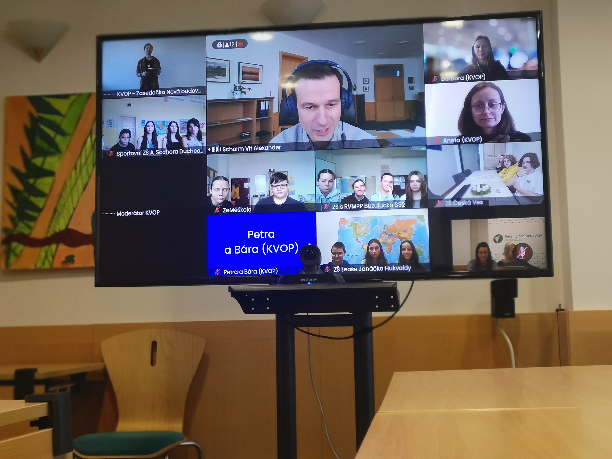

Na podzim jsme připravili pro žáky a žákyně 8. a 9. tříd vybraných základních školy výzvu – Zkusme to změnit! Úkolem dětí bylo:

* pojmenovat, co by chtěly ve své škole změnit, 
* navrhnout, jak by to šlo provést, 
* a pustit se do akce. 

**Navrhovat mohly změny dotýkající se chodu školy, klima a vztahů ve škole či systémových témat. A jak se s tím děti vypořádaly? Většinou skvěle!**

Zapojilo se dvanáct školních kolektivů a vymyslely mnoho dobrých projektů. Nejčastěji se zabývaly tím, jak zajistit ve škole možnost nakoupit si jídlo na svačinu (v bufetu nebo automatu), vybrat si jídlo ve školní jídelně nebo obnovit dodávky dotovaného ovoce. Poptávaly ale také zkvalitnění výuky finanční gramotnosti, zakotvení druhého cizího jazyka jako volitelného předmětu nebo možnost vybírat si z nabídky volitelných předmětů. Některé skupiny také vymyslely, jak by mohly u školy vybudovat stojany na kola a koloběžky, umístit na chodby školy deskové hry nebo pouštět o přestávkách hudbu ze školního rozhlasu.

Se svými projekty se nám všechny kolektivy pochlubily během on-line setkání participační skupiny. Společně jsme o nich diskutovali, sdíleli zkušenosti a hledali možnosti, jak všechny projekty zrealizovat. 

**Jsme zvědaví, kam se projekty podaří posunout, a těšíme se na výsledky!**

> Participační skupina byla realizována v rámci projektu Posílení aktivit veřejného ochránce práv v ochraně lidských práv (směrem k ustavení Národní lidskoprávní instituce v ČR), číslo projektu LP-PDP3-001. Projekt je součástí Programu lidská práva financovaného z Norských fondů 2014-2021 prostřednictvím Ministerstva financí.