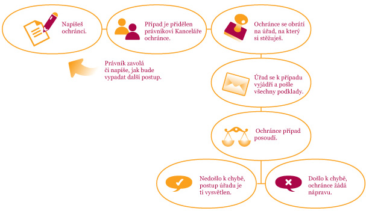

- Tvůj e-mail nebo dopis je v co nejkratší možné době přidělen konkrétnímu právníkovi nebo právničce k posouzení, který se ti nejpozději do týdne ozve (například telefonem nebo e-mailem podle toho, co jsi zvolil/a jako pro Tebe nejlepší variantu) a dostaneš základní informace o tom, jak ti ochránce může nebo nemůže pomoci.

- Pokud půjde o záležitost, kterou se ochránce zabývat nemůže, pověřený právník se ti pokusí poradit, na koho nebo kam se můžeš obrátit.

- Půjde-li o věc, kterou ochránce řešit může (viz část Čím se zabývá), postup bude následující:´

1. V prvé řadě se s právníkem, který bude mít tvůj případ na starosti, domluvíte na dalším postupu - například se dohodnete, jestli je pro tebe lepší komunikovat e-mailem nebo telefonicky, jestli chceš, abychom ti vykali nebo tykali a podobné „organizační“ věci (pokud použiješ interaktivní formulář, můžeš tyto otázky vyřešit již při podání stížnosti)

2. Pokud nebudeš chtít, aby někdo věděl o tom, že ses nám svěřil/a se svým problémem, budeme se snažit tvé přání respektovat. V případě, že by to nebylo možné, pokusíme se společně najít i pro tebe přijatelné řešení.

3. Dále ti právník vysvětlí, jakým způsobem bude ochránce při řešení tvého problému postupovat. Zpravidla osloví úřad, na který si stěžuješ (tzn.zahájí šetření). V případě zjištění nesprávného postupu úřadu bude ochránce žádat nápravu.

Buď trpělivý/á, ne každý problém může ochránce vyřešit tak rychle, jak by sis přál. Pověřený právník s tebou bude ve spojení a bude tě průběžně informovat o vývoji šetření.

