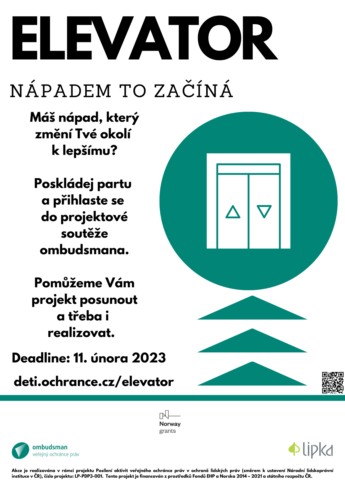

**Pro všechny studentky a studenty středních škol vyhlašujeme ve spolupráci s [Lipka – školské zařízení pro environmentální vzdělávání](https://www.lipka.cz/) projektovou soutěž Elevator: nápadem to začíná.**

Chceme, aby se mladí lidé:

* aktivně zajímali o své okolí, 
* vzájemně spolupracovali a prozkoumávali možnosti, které se nabízí ke zlepšení jejich okolí, 
* seznámili s překážkami, pro které dosud nebylo možné změnit neutěšený stav okolí, 
* naučili jasně formulovat své nápady a uvažovali při tom realisticky a udržitelně,
* sami navrhli smysluplnou a proveditelnou variantu řešení, kterou se pokusí zrealizovat.

**Aby cesta k úspěchu byla jednodušší, nabízíme k tomu motivující soutěžní prostředí, naše tipy a zkušenosti.** 

### Proč se zapojit do soutěže?

Všechny přihlášené týmy získají:

1. možnost zúčastnit se webináře na téma plánování projektu, jeho managementu a zpracování projektové žádosti,
2. možnost on-line konzultace projektu,
3. písemnou zpětnou vazbu k odevzdanému projektu,
4. možnost sledovat on-line přenos z hlavní části květnového setkání pro vybrané týmy,
5. certifikát potvrzující zapojení do soutěže,
6. možnost domluvit si individuální exkurzi pro třídní kolektiv v Kanceláři veřejného ochránce práv v Brně.

Vybrané týmy nadto získají možnost zúčastnit se květnového setkání, kde:

1. budou prezentovat svůj projekt, seznámí se s ostatními projekty a budou moci sdílet zkušenosti a dobrou praxi,
2. získají zpětnou vazbu k projektu a individualizovanou konzultaci a odborné poradenství od Kanceláře veřejného ochránce práv, Centra podpory podnikavosti (mj. autorek projektu [Podnikavá mysl](https://www.podnikavamysl.cz/cz/)) a [Domu zahraniční spolupráce](https://www.dzs.cz/) (zprostředkovává financování mj. studentských projektů napříč Evropou – např. Erasmus+, Evropský sbor solidarity, projekty EHP a další),
3. se zúčastní workshopu na téma projektového managementu (pro pedagogický doprovod je připraven workshop představující metody práce se studentským kolektivem – jak děti aktivizovat a motivovat k zapojení do veřejného života a ovlivnění světa kolem sebe),
4. se je pokusíme propojit se zástupkyněmi či zástupci samospráv či státní správy, nadací, podnikatelských inkubátorů či dalších donátorů, kteří by jim mohli pomoci s realizací projektu,
5. dostanou občerstvení, drobné odměny a proplacené cestovní náklady související s (veřejnou) dopravou na setkání (platí pro zástupkyně a zástupce týmů a jejich pedagogický doprovod).

### Kdo se může přihlásit a jak?

Přihlásit se může tým složený minimálně ze tří studentek nebo studentů střední školy nebo odpovídajících ročníků víceletých gymnázií. Členky a členové týmu nemusí být z jedné třídy ani školy. Každý může být součástí pouze jednoho týmu. Počet týmů na jednu školu není omezen.

Tým musí mít svou garantku nebo svého garanta z řad pedagogického kolektivu školy. Garant/ka může vést více týmů. Je-li tým složený ze studentek a studentů více škol, zvolí si pouze jednu garantku či jednoho garanta.

**Přihlásit do soutěže se můžete [on-line](https://forms.gle/TU6gX7rpYFqgavn59), a to do 11. února 2023 (23:59).** Pro přihlášení musíte pojmenovat členy týmu, napsat nám název Vašeho projektu a jeho stručnou anotaci. Projekt ještě nemusíte mít rozpracovaný.

### Jaké projekty je možné přihlásit?

**Projekt musí:**

* řešit problém nebo nevyhovující situaci, které jste zaznamenali ve svém okolí (škála oblastí, které se projekty mohou dotknout, je široká – např. veřejný prostor, volnočasové aktivity, přístup k úřadům, zapojení se do života ve městě, bezpečnost na ulici či na silnici, dopravní situace, životní prostředí, kultura, jinakost, přístup k pomoci nebo podpoře v otázkách financí, zdraví či duševní pohoda),
* být veřejně prospěšný,
* navrhovat jednorázová, dlouhodobá či systémová řešení, případně být potenciálním podnikatelským záměrem.

**Projekt nesmí:**

* primárně cílit na život ve škole, její fungování a školský systém,
* propagovat produkty, služby, činnosti či stanoviska subjektů komerčního i nekomerčního charakteru, zejména náboženského či politického.

### Co dál?

Po vyplnění přihlášky nám musíte do 11. dubna 2023 (23:59) zaslat návrh projektu prostřednictvím [webového formuláře](https://forms.gle/cTvL3iYXMuKgrkSb6). Plné znění projektového formuláře je k nahlédnutí [zde](/media/formular_navrhu_projektu.pdf).

Podrobnosti o soutěži a přesný časový harmonogram naleznete zde.

### Pro garanty a garantky (pedagogický doprovod)

Chcete své studentky a studenty lépe motivovat? Zkuste se inspirovat následujícími materiály: 

* [nápady na krátké aktivity s žáky](https://www.podnikavamysl.cz/cz/materialy/uvedomeni-si-prilezitosti),
* [kreativní zápisník nápadů pro město](https://skoly.damenavas.cz/publikace/) – radí, jak poutavě učit o městě a motivovat děti k péči o něj,
* [JICskill ](https://skill.jic.cz/)– ideální pro práci se středoškolskými kolektivy, motivuje k práci s vlastním nápadem. 

**Případné dotazy Vám zodpoví pověřená pracovnice Kanceláře veřejného ochránce práv Mgr. Petra Marie Andrášik na telefonním čísle 602 468 476 nebo e-mailu andrasik@ochrance.cz.** 

> Aktivita je realizována v rámci projektu Posílení aktivit veřejného ochránce práv v ochraně lidských práv (směrem k ustavení Národní lidskoprávní instituce v ČR), číslo projektu LP-PDP3-001. Projekt je součástí Programu lidská práva financovaného z Norských fondů 2014-2021 prostřednictvím Ministerstva financí ČR.