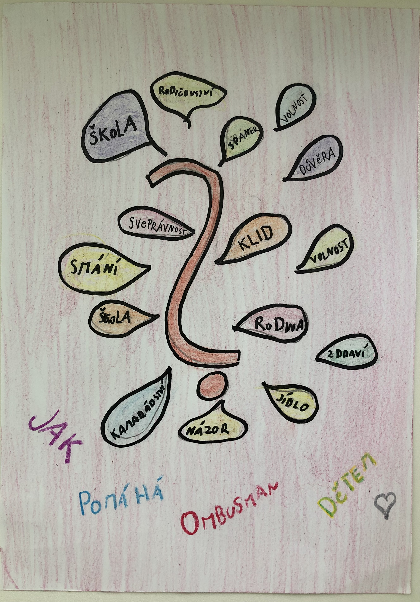

* VIDEA

Základní škola Malonty

<iframe width="750" height="422" src="https://www.youtube.com/embed/QFduZPnzfAc?list=PLWNv_IxgJdEJbpY3TQjzjoaX74aVxIGvc" title="YouTube video player" frameborder="0" allow="accelerometer; autoplay; clipboard-write; encrypted-media; gyroscope; picture-in-picture" allowfullscreen></iframe>

Základní škola Lučany nad Nisou

<iframe width="750" height="422" src="https://www.youtube.com/embed/QW0s78BsraE?list=PLWNv_IxgJdEJbpY3TQjzjoaX74aVxIGvc" title="YouTube video player" frameborder="0" allow="accelerometer; autoplay; clipboard-write; encrypted-media; gyroscope; picture-in-picture" allowfullscreen></iframe>

Základní škola Buzulucká, Teplice

<iframe width="750" height="422" src="https://www.youtube.com/embed/5LCVOxD03XY?list=PLWNv_IxgJdEJbpY3TQjzjoaX74aVxIGvc" title="YouTube video player" frameborder="0" allow="accelerometer; autoplay; clipboard-write; encrypted-media; gyroscope; picture-in-picture" allowfullscreen></iframe>

Základní škola J. Babáka, Brno

<iframe width="750" height="422" src="https://www.youtube.com/embed/GHErrM9yuGs?list=PLWNv_IxgJdEJbpY3TQjzjoaX74aVxIGvc" title="YouTube video player" frameborder="0" allow="accelerometer; autoplay; clipboard-write; encrypted-media; gyroscope; picture-in-picture" allowfullscreen></iframe>

<iframe width="750" height="422" src="https://www.youtube.com/embed/ZuyewD03t9c?list=PLWNv_IxgJdEJbpY3TQjzjoaX74aVxIGvc" title="YouTube video player" frameborder="0" allow="accelerometer; autoplay; clipboard-write; encrypted-media; gyroscope; picture-in-picture" allowfullscreen></iframe>

Základní škola T. G. Masaryka, Hrádek nad Nisou

<iframe width="750" height="406" src="https://www.youtube.com/embed/qPz5azSEvOI?list=PLWNv_IxgJdEJbpY3TQjzjoaX74aVxIGvc" title="YouTube video player" frameborder="0" allow="accelerometer; autoplay; clipboard-write; encrypted-media; gyroscope; picture-in-picture" allowfullscreen></iframe>

Základní škola J. A. Komenského, Fulnek

<iframe width="750" height="422" src="https://www.youtube.com/embed/pl55VIFWrIU?list=PLWNv_IxgJdEJbpY3TQjzjoaX74aVxIGvc" title="YouTube video player" frameborder="0" allow="accelerometer; autoplay; clipboard-write; encrypted-media; gyroscope; picture-in-picture" allowfullscreen></iframe>

Základní škola Vítězná, Litovel

<iframe width="750" height="431" src="https://www.youtube.com/embed/0ivSYmhx6aE?list=PLWNv_IxgJdEJbpY3TQjzjoaX74aVxIGvc" title="YouTube video player" frameborder="0" allow="accelerometer; autoplay; clipboard-write; encrypted-media; gyroscope; picture-in-picture" allowfullscreen></iframe>

Základní škola M. Švabinského, Teplice

<iframe width="750" height="412" src="https://www.youtube.com/embed/Jf7T-F824Xg?list=PLWNv_IxgJdEJbpY3TQjzjoaX74aVxIGvc" title="YouTube video player" frameborder="0" allow="accelerometer; autoplay; clipboard-write; encrypted-media; gyroscope; picture-in-picture" allowfullscreen></iframe>

<iframe width="750" height="743" src="https://www.youtube.com/embed/o_hkV1u49to?list=PLWNv_IxgJdEJbpY3TQjzjoaX74aVxIGvc" title="YouTube video player" frameborder="0" allow="accelerometer; autoplay; clipboard-write; encrypted-media; gyroscope; picture-in-picture" allowfullscreen></iframe>

Gymnázium Bystřice nad Perštejnem

<iframe width="750" height="425" src="https://www.youtube.com/embed/BFKQ1sz9xuM?list=PLWNv_IxgJdEJbpY3TQjzjoaX74aVxIGvc" title="YouTube video player" frameborder="0" allow="accelerometer; autoplay; clipboard-write; encrypted-media; gyroscope; picture-in-picture" allowfullscreen></iframe>

Gymnázium Ivančice

<iframe width="750" height="425" src="https://www.youtube.com/embed/ePxQd0k29Pg?list=PLWNv_IxgJdEJbpY3TQjzjoaX74aVxIGvc" title="YouTube video player" frameborder="0" allow="accelerometer; autoplay; clipboard-write; encrypted-media; gyroscope; picture-in-picture" allowfullscreen></iframe>

<iframe width="750" height="422" src="https://www.youtube.com/embed/bRLiYvnvUD0?list=PLWNv_IxgJdEJbpY3TQjzjoaX74aVxIGvc" title="YouTube video player" frameborder="0" allow="accelerometer; autoplay; clipboard-write; encrypted-media; gyroscope; picture-in-picture" allowfullscreen></iframe>

Gymnázium O. Havlové, Ostrava-Poruba

<iframe width="750" height="422" src="https://www.youtube.com/embed/Bz1REPuq2GY?list=PLWNv_IxgJdEJbpY3TQjzjoaX74aVxIGvc" title="YouTube video player" frameborder="0" allow="accelerometer; autoplay; clipboard-write; encrypted-media; gyroscope; picture-in-picture" allowfullscreen></iframe>

Podkrušnohorská svobodná základní škola, Údlice

<iframe width="750" height="422" src="https://www.youtube.com/embed/IISSjSPqVSM?list=PLWNv_IxgJdEJbpY3TQjzjoaX74aVxIGvc" title="YouTube video player" frameborder="0" allow="accelerometer; autoplay; clipboard-write; encrypted-media; gyroscope; picture-in-picture" allowfullscreen></iframe>

Základní škola Komenského, Staré Město

<iframe width="750" height="422" src="https://www.youtube.com/embed/Za9hM1jmUnI?list=PLWNv_IxgJdEJbpY3TQjzjoaX74aVxIGvc" title="YouTube video player" frameborder="0" allow="accelerometer; autoplay; clipboard-write; encrypted-media; gyroscope; picture-in-picture" allowfullscreen></iframe>

<iframe width="750" height="422" src="https://www.youtube.com/embed/ytyESm900Ks?list=PLWNv_IxgJdEJbpY3TQjzjoaX74aVxIGvc" title="YouTube video player" frameborder="0" allow="accelerometer; autoplay; clipboard-write; encrypted-media; gyroscope; picture-in-picture" allowfullscreen></iframe>

* POSTERY A OBRÁZKY

Základní škola Česká Ves

Základní škola Raspenava

Základní škola B. Dvorského, Ostrava - Bělský Les

Základní škola B. Dvorského, Ostrava - Bělský Les

Základní škola B. Dvorského, Ostrava - Bělský Les

Základní škola B. Dvorského, Ostrava - Bělský Les

Základní škola Vajgar, Jindřichův Hradec

Základní škola Vajgar, Jindřichův Hradec

Masarykova základní škola, Melč

* LITERÁRNÍ DÍLA

  /media/zs_luzec.docx

*
* PREZENTACE