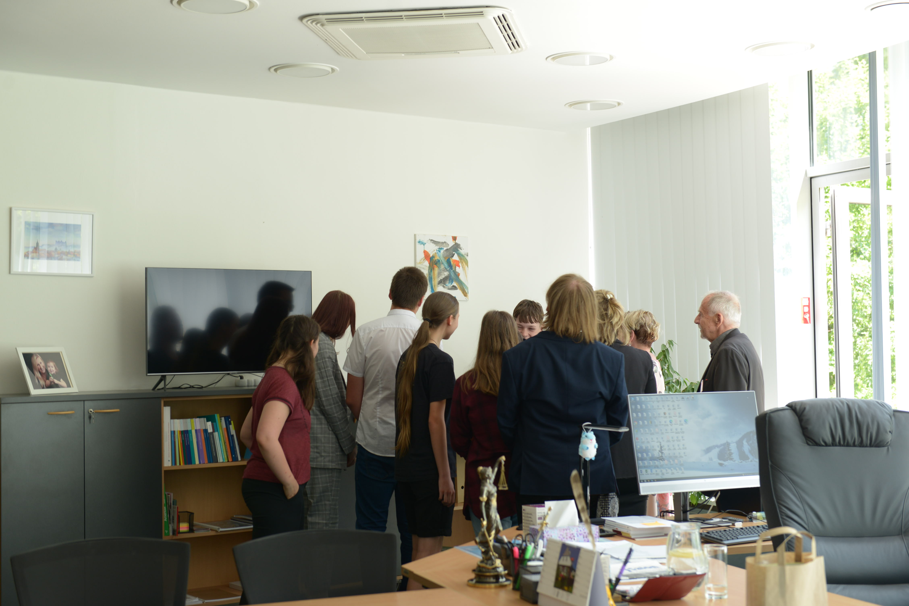
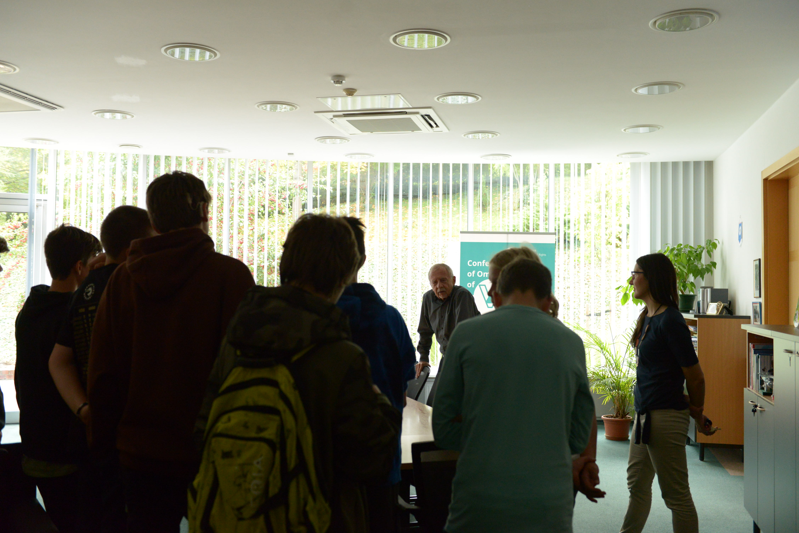
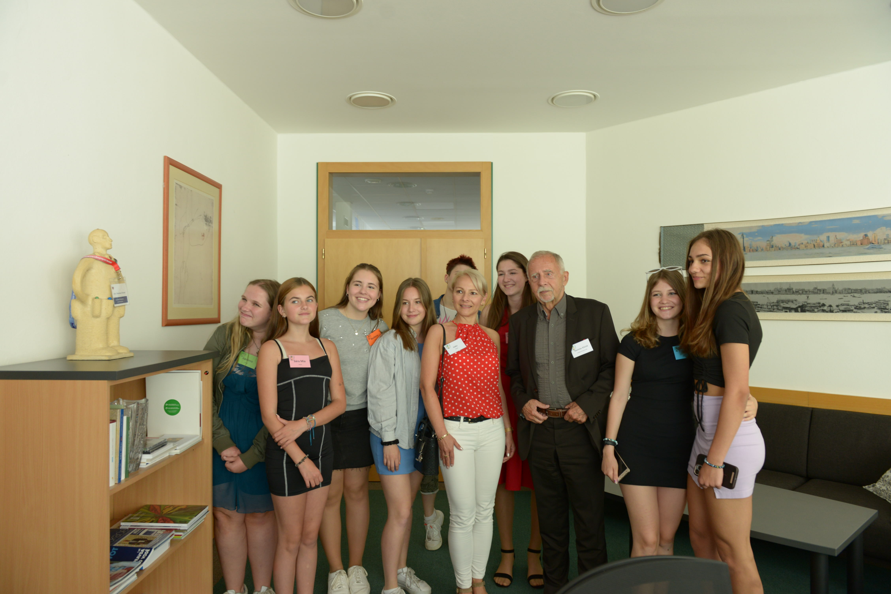
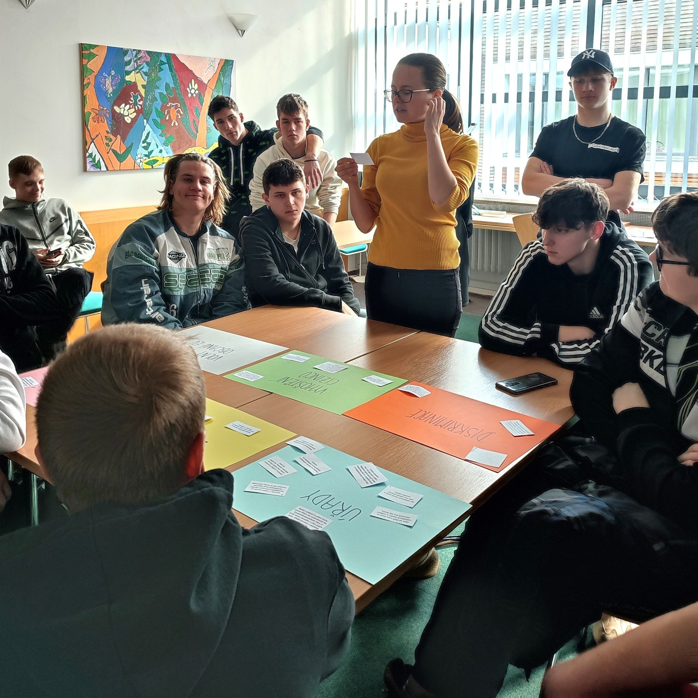
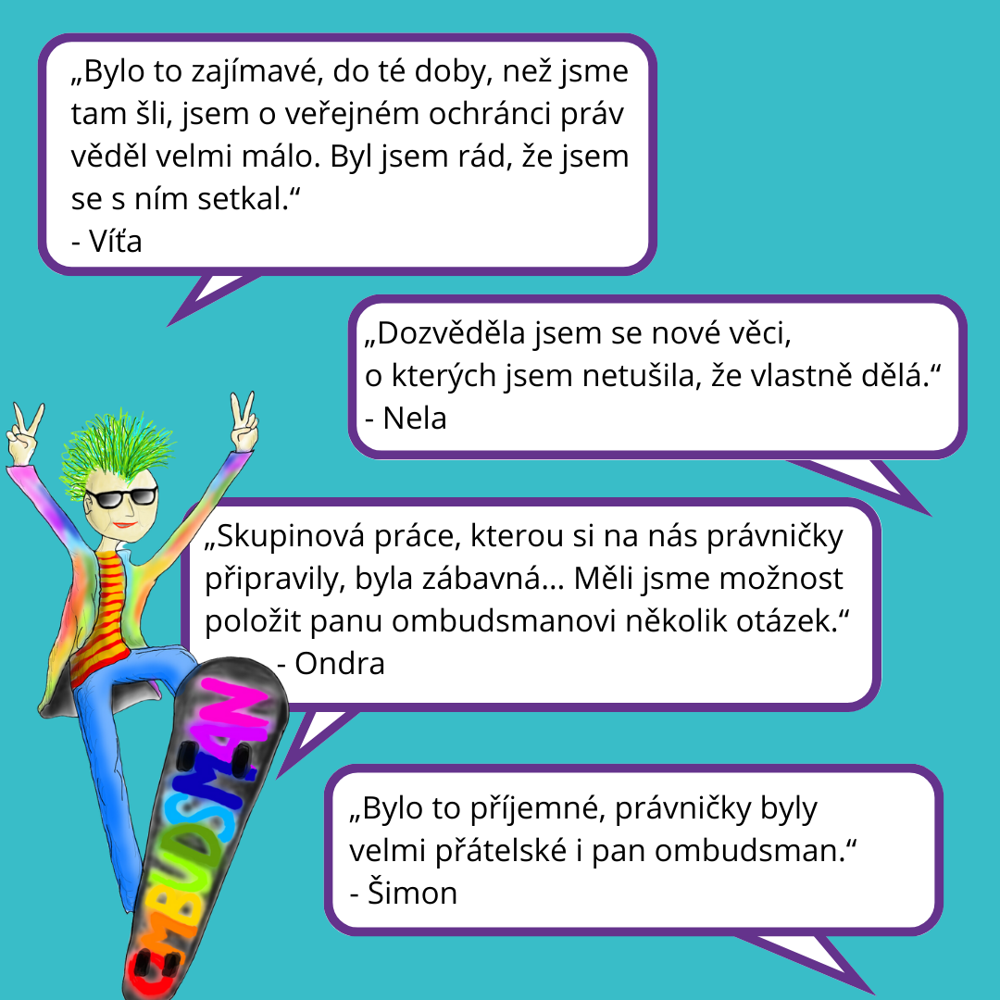

**Domluv se se svým učitelem nebo svou učitelkou a napište nám na deti@ochrance.cz.** Domluvíme se na konkrétním termínu, kdy nás můžeš navštívit i se svými spolužáky a spolužačkami.

### Co nabízíme?

Zhruba dvouhodinový program, během kterého:

* vás na příkladech seznámíme s tím, co děláme,
* ukážeme vám zákoutí naší budovy (kde pracujeme, kde se vzděláváme, kde relaxujeme, kde chováme včely i kde řádí "naše děti") a 
* budete se moci zeptat ombudsmana nebo jeho zástupce na cokoliv, co vás zajímá. 

### Pro koho?

* školní kolektivy či jiné zájmové skupiny dětí,
* šesťáky a starší.

> Sídlo máme pouze v Brně, takže i exkurze probíhají pouze [v Brně na adrese Údolní 39](https://www.ochrance.cz/kontakt/). 
>
> **POZOR:** Kolem naší budovy se aktuálně kope! [Jak to ovlivňuje přístup?](https://kopemezabrno.cz/uzavirky-a-omezeni/udolni-usek-mezi-husovou-a-jirikovskeho/)

