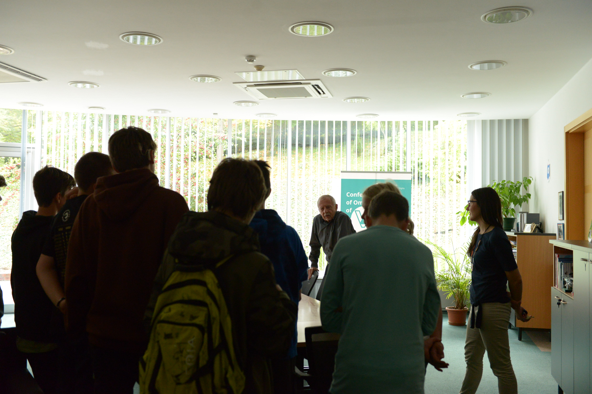
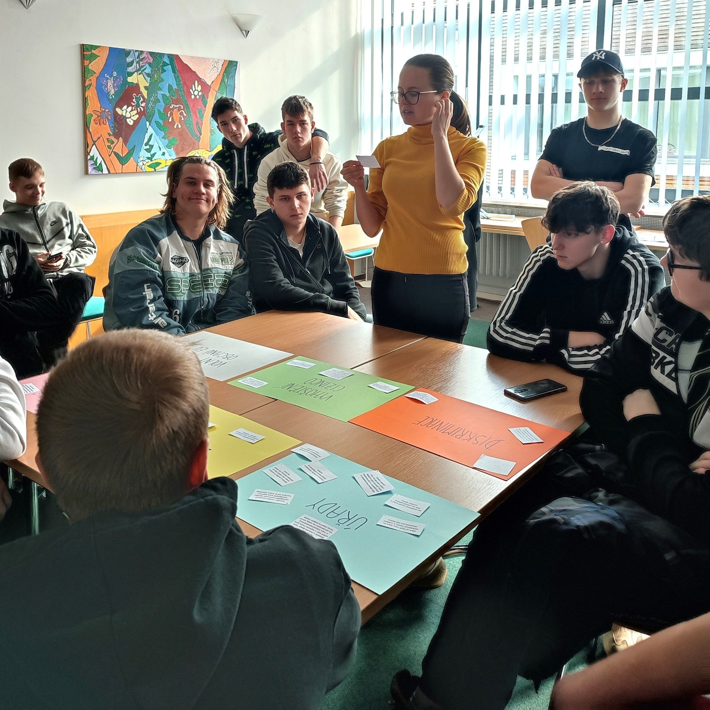

**Domluv se se svým učitelem nebo svou učitelkou a napište nám na deti@ochrance.cz.** Ideálně rovnou uveďte:

* termíny (dny a čas), které by se vám hodily (budeme se snažit vám vyjít vstříc, ne vždy je to ale možné), 
* kolik by vás přijelo (rozdělíme si vás do skupin maximálně po třiceti; v jeden čas zvládneme pracovat maximálně se dvěma skupinami zároveň),
* kdo by přijel (z jaké jste školy, který ročník, obor studia nebo že jste například studentský parlament), 
* má-li někdo z vás jakékoliv speciální potřeby (např. se pohybuje na vozíku, špatně vidí, nemluví perfektně česky,...), 
* e-mail a telefon na někoho, s kým se můžeme domluvit.

### Co nabízíme?

Zhruba dvouhodinový program, během kterého:

* vás na příkladech seznámíme s tím, co děláme,
* ukážeme vám zákoutí naší budovy (kde pracujeme, kde se vzděláváme, kde relaxujeme, kde chováme včely i kde řádí "naše děti") a 
* budete se moci zeptat ombudsmana nebo jeho zástupce na cokoliv, co vás zajímá. 

### Pro koho?

* školní kolektivy či jiné zájmové skupiny dětí,
* šesťáky a starší.

> Sídlo máme pouze v Brně, takže i exkurze probíhají pouze [v Brně na adrese Údolní 39](https://www.ochrance.cz/kontakt/). 
>
>

