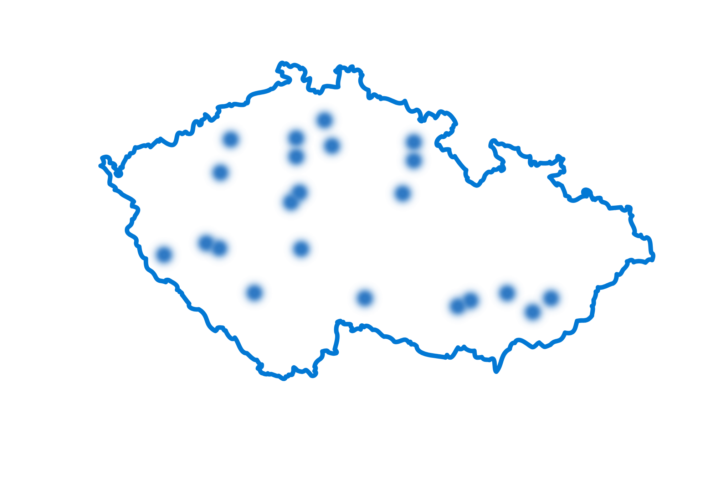

**Podněty pro dětského ombudsmana**

Od 1. července poslaly děti svému ombudsmanovi 176 podnětů. Často se týkaly například rodičovských sporů, postupů škol nebo poměrů v dětských zařízeních. Na základě jednoho z podnětů dětský ombudsman poprvé využil svou pravomoc a vstoupil do soudního řízení, aby podpořil práva dospívajícího chlapce a jeho mladšího bratra. 

Dalších 1381 podnětů přišlo do rukou dětského ombudsmana od dospělých. Jeden takový nedávno zaujal i veřejnost. Šlo o případ Cermatu a jeho pravidla o tom, že opuštění učebny v průběhu přijímací zkoušky znamená její konec. 

> I když zákon dětského ombudsmana v Česku ustanovil od 1. července 2025, jeho prvního představitele Martina Beneše zvolili poslanci až 6. března 2026. Ve své funkci začal působit 1. dubna. Do té doby jeho činnost vykonával zástupce ombudsmana a dětského ombudsmana Vít Alexander Schorm. 
>
> Martin Beneš již krátce po vstupu do funkce uvedl, jaké priority budou určovat jeho práci: *„Za klíčová považuji péči o duševní zdraví dětí a mladých lidí, moderní a dostupné vzdělávání a také funkční systém ochrany ohrožených dětí, včetně zajištění kvalitní péče o děti, které nemohou vyrůstat ve vlastních rodinách.“*

**Systémové otázky**

Kromě jednotlivých případů se dětský ombudsman v uplynulém roce zabýval i řadou systémových témat jako je například dostupnost škol pro děti s postižením nebo třeba zákaz mobilů ve školách. 

Vyjadřoval se k některým návrhům zákonů a žádal, aby zohledňovaly zájmy dětí. V poslední době takto například upozornil na to, že veřejnoprávní média musí nadále sloužit i dětem, či podpořil návrh, podle kterého by lidé od 16 let mohli volit zastupitele obcí. 

Připravil také vyjádření pro Ústavní soud, který rozhodoval o zrušení zvláštních zápisů pro ukrajinské prvňáčky. 

**Návštěvy dětských domovů**

Nadto dětský a veřejný ochránce práv (jako národní preventivní mechanismus před špatným zacházením) společně navštěvují napříč celým Českem místa, jako jsou dětské domovy a další zařízení, kde dlouhodobě pobývají děti. Od 1. července až doposud proběhlo celkem 22 takových návštěv. Ty odhalily jak některá pochybení, tak i dobrou praxi. 

**Dialog s dětmi**

Svůj velký úkol vidí Martin Beneš i v přímé komunikaci s dětmi: „Navštívil jsem několik škol a dětských domovů a budu v tom dál pokračovat. Bavím se s dětmi o tom, jaká mají práva. Vysvětluji jim, proč je musíme chránit a taky, co pro to dělám já.  Na oplátku od nich chci slyšet, co ony samy považují za důležité nebo problematické.“ 

Dětský ombudsman otevírá i dveře svého brněnského sídla – nejčastěji v rámci školních exkurzí. Za posledních 11 měsíců jej takto navštívily stovky žáků a studentů ze 38 škol.  

Již brzy zahájí Martin Beneš s dětmi také další formu dialogu. Ještě před prázdninami se setká se svým novým poradním týmem: *„Mám velkou radost, že se děti chtějí zapojovat do věcí, které se jich týkají. Důkazem je asi 700 přihlášek, které jsme obdrželi v reakci na naši veřejnou výzvu. Výsledný tým bude mít kolem 30 dětských poradců. Ty určíme losem už během tohoto týdne.“*
